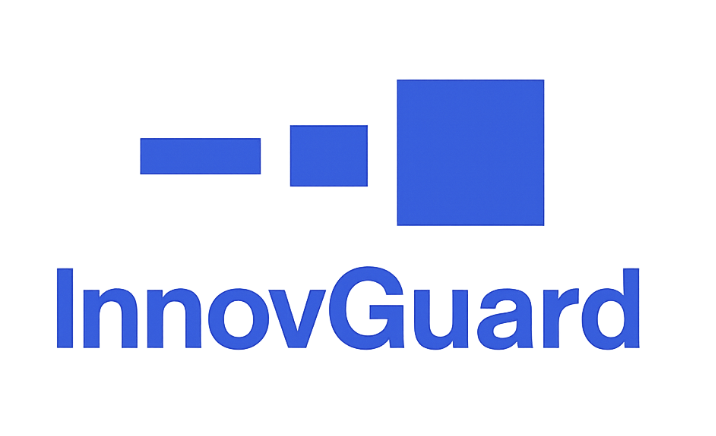

# Awesome AI Security 
Curated resources, research, and tools for securing AI systems. Managed by [AISecHub](https://www.linkedin.com/groups/14545517/). **Sponsored by:** [InnovGuard](https://www.innovguard.com/)

   
  <em>Technology Risk &amp; Cybersecurity Advisory - Innovate and Invest with Confidence, Lead with Assurance.</em>

---

## Table of Contents

- [Best Practices, Frameworks & Controls](#best-practices-frameworks--controls)
  - [Governance & Management Frameworks](#governance--management-frameworks)
  - [Controls & Verification Standards](#controls--verification-standards)
  - [Implementation Guides & Patterns](#implementation-guides--patterns)
  - [Testing, Evaluation & Red Teaming](#testing-evaluation--red-teaming)
  - [Agentic Systems - (Standards, Governance & Patterns](#agentic-systems-standards-governance--patterns)
  - [Threat Modeling](#threat-modeling)
  - [Policy Templates](#policy-templates)
  - [Toolkits & Self-Assessments](#toolkits--self-assessments)
  - [Critical Infrastructure](#critical-infrastructure)
- [Tools](#tools)
- [Models](#models)
- [Research Working Groups](#research-working-groups)
- [Attack & Defense Matrices](#attack--defense-matrices)
- [Checklists](#checklists)
- [Newsletter](#newsletter)
- [Datasets](#datasets)
  - [Phishing](#phishing)
  - [Cybersecurity Knowledge](#cybersecurity-knowledge)
  - [Secure Coding & Vulnerability Detection](#secure-coding--vulnerability-detection)
  - [Deepfake](#deepfake)
  - [Jailbreak](#jailbreak)
  - [Prompt Injection](#prompt-injection)
  - [System Prompts](#system-prompts)
- [Courses & Certifications](#courses--certifications)
- [Training](#training)
- [Reports and Research](#reports-and-research)
  - [Vendor Reports](#vendor-reports)
  - [Research Papers](#research-papers)
  - [Research Feed](#research-feed)
  - [Reports](Reports.md)
- [Books](#books)
- [Communities & Social Groups](#communities--social-groups)
- [Benchmarking](#benchmarking)
- [Incident Response](#incident-response)
  - [Incident Repositories, Trackers & Monitors](#incident-repositories-trackers--monitors)
  - [Guides & Playbooks](#guides--playbooks)
- [Supply Chain Security](#supply-chain-security)
- [Videos & Playlists](#videos--playlists)
- [Conferences](https://github.com/TalEliyahu/Awesome-AI-Security/blob/main/Conferences.md)
- [Foundations: Glossary, SoK/Surveys & Taxonomies](#foundations-glossary-soksurveys--taxonomies)
- [Podcasts](#podcasts)
- [Market Landscape](#market-landscape)
- [Blogs](#blogs)
  - [Industry Leaders](#industry-leaders)
  - [Startup Blogs](#startup-blogs)
- [Related Awesome Lists](#related-awesome-lists)
- [Common Acronyms](#common-acronyms)

---

## Best Practices, Frameworks & Controls

### Governance & Management Frameworks
- [NIST - AI Risk Management Framework (AI RMF)](https://www.nist.gov/itl/ai-risk-management-framework)
- [ISO/IEC 42001 (AI Management System)](https://www.iso.org/standard/81230.html)
- [OWASP - AI Maturity Assessment (AIMA)](https://github.com/OWASP/www-project-ai-maturity-assessment) 
- [Google - Secure AI Framework (SAIF)](https://saif.google/)
- [OWASP - LLM & GenAI Security Center of Excellence (CoE) Guide](https://genai.owasp.org/resource/llm-and-generative-ai-security-center-of-excellence-guide/)
- [CSA - AI Model Risk Management Framework](https://cloudsecurityalliance.org/artifacts/ai-model-risk-management-framework)
- [NIST - Artificial Intelligence Risk Management Framework: Generative Artificial Intelligence Profile](https://nvlpubs.nist.gov/nistpubs/ai/NIST.AI.600-1.pdf)
- [AI Security Shared Responsibility Model](https://github.com/mikeprivette/ai-security-shared-responsibility) 

### Controls & Verification Standards
- [OWASP - LLM Security Verification Standard (LLMSVS)](https://github.com/OWASP/www-project-llm-verification-standard) 
- [OWASP - Artificial Intelligence Security Verification Standard (AISVS)](https://github.com/OWASP/AISVS) 
- [CSA - AI Controls Matrix (AICM)](https://cloudsecurityalliance.org/artifacts/ai-controls-matrix) - The AICM contains 243 control objectives across 18 domains and maps to ISO 42001, ISO 27001, NIST AI RMF 1.0, and BSI AIC4. Freely downloadable.

#### Top 10s
- [OWASP - Top 10 for Large Language Model Applications](https://github.com/OWASP/www-project-top-10-for-large-language-model-applications) 
- [CSA - MCP Client Top 10](https://modelcontextprotocol-security.io/top10/client/) 
- [CSA - MCP Server Top 10](https://modelcontextprotocol-security.io/top10/server/)

#### Scoring & Rating Systems
- [OWASP - Artificial Intelligence Vulnerability Scoring System](https://github.com/OWASP/www-project-artificial-intelligence-vulnerability-scoring-system) 

### Testing, Evaluation & Red Teaming
- [OWASP - AI Testing Guide](https://github.com/OWASP/www-project-ai-testing-guide) 
- [OWASP - Red Teaming Guide](https://genai.owasp.org/resource/genai-red-teaming-guide/)
- [OWASP - LLM Exploit Generation](https://genai.owasp.org/resource/owasp-llm-exploit-generation-v1-0-pdf/)
- [CSA - Agentic AI Red Teaming Guide](https://cloudsecurityalliance.org/artifacts/agentic-ai-red-teaming-guide)
- [OWASP AI Testing Guide](https://github.com/OWASP/www-project-ai-testing-guide/raw/5c6d357e2290e8c81ab7e6673950e978e1b83604/PDFGenerator/V1.0/OWASP-AI-Testing-Guide-v1.pdf) – Open standard for trustworthiness testing of AI systems, providing shared terminology and a structured approach to AI testing.

### Implementation Guides & Patterns

- **OWASP**
  - [OWASP - AI Security and Privacy Guide](https://github.com/OWASP/www-project-ai-security-and-privacy-guide) 
  - [OWASP - LLM and Gen AI Data Security Best Practices](https://genai.owasp.org/resource/llm-and-gen-ai-data-security-best-practices/)
- [CSA - Secure LLM Systems: Essential Authorization Practices](https://cloudsecurityalliance.org/artifacts/securing-llm-backed-systems-essential-authorization-practices)
- [OASIS CoSAI - Preparing Defenders of AI Systems](https://github.com/cosai-oasis/ws2-defenders/blob/main/preparing-defenders-of-ai-systems.md) 
- [DoD CIO - AI Cybersecurity Risk Management Tailoring Guide (2025)](https://dodcio.defense.gov/Portals/0/Documents/Library/AI-CybersecurityRMTailoringGuide.pdf) - Practical RMF tailoring for AI systems across the lifecycle; complements CDAO’s RAI toolkit.
- [NCSC (UK) - Guidelines for Secure AI System Development](https://www.ncsc.gov.uk/collection/guidelines-secure-ai-system-development) - End-to-end secure AI SDLC (secure design, development, deployment, and secure operation & maintenance), including logging/monitoring and update management.
- [SANS – Critical AI Security Guidelines](https://github.com/sans-community/ai-guidelines)  - Control-focused guidance for securing AI/LLM systems across six domains (e.g., access controls, data protection, inference security, monitoring, GRC).
- [BSI – Security of AI Systems: Fundamentals](https://www.bsi.bund.de/SharedDocs/Downloads/EN/BSI/KI/Security-of-AI-systems_fundamentals.pdf) - Sector-agnostic fundamentals: lifecycle threat model (data/model/pipeline/runtime), adversarial ML attacks (poisoning, evasion, inversion, extraction, backdoors), and baseline controls for design→deploy→operate, plus assurance/certification guidance.
- [MITRE – SAFE-AI: A Framework for Securing AI-Enabled Systems](https://www.compliancehub.wiki/content/files/2025/07/mitresafeAI.pdf) - Threat-informed RMF overlay for AI: maps AI/ATLAS tactics to NIST SP 800-53 controls, lists ~100 AI-affected controls, and includes assessor interview Q&A sets to plan SCAs.
- [NIST - SP 800-218A: Secure Software Development Practices for Generative AI & Dual-Use Foundation Models (SSDF Community Profile)](https://nvlpubs.nist.gov/nistpubs/SpecialPublications/NIST.SP.800-218A.pdf) - Community profile of NIST’s SSDF tailored to generative AI and dual-use foundation models; adds AI-specific tasks across the lifecycle (data/model provenance, evaluation & red teaming, supply chain assurance, incident response).
 
- **NSA - Artificial Intelligence Security Center (AISC)**
  - [Deploying AI Systems Securely (CSI)](https://media.defense.gov/2024/Apr/15/2003439257/-1/-1/0/CSI-DEPLOYING-AI-SYSTEMS-SECURELY.PDF) - Practical, ops-focused guidance for deploying/operating externally developed AI systems (with CISA, FBI & international partners); complements NCSC’s secure-AI dev guidelines.
  - [AI Data Security: Best Practices for Securing Data Used to Train & Operate AI Systems (CSI)](https://www.nsa.gov/Press-Room/Press-Releases-Statements/Press-Release-View/Article/4192332/nsas-aisc-releases-joint-guidance-on-the-risks-and-best-practices-in-ai-data-se/) - Joint guidance on securing data across the AI lifecycle.
  - [Content Credentials: Strengthening Multimedia Integrity in the Generative AI Era (CSI)](https://media.defense.gov/2025/Jan/23/2003639157/-1/-1/0/CSI-CONTENT-CREDENTIALS-STRENGTHENING-MULTIMEDIA-INTEGRITY.PDF) - Provenance and Durable Content Credentials for transparent media.
  - [Contextualizing Deepfake Threats to Organizations (CSI)](https://media.defense.gov/2023/Sep/12/2003298925/-1/-1/0/CSI-DEEPFAKE-THREATS.PDF) - Risks, impacts, and mitigations for synthetic media targeting orgs.
- **FS-ISAC - Framework of an Acceptable Use Policy for External Generative AI** - framework-style guidance (not a template) with *permissive vs. stringent* clause options for inputs/outputs, access control, monitoring, and representation. [PDF](https://www.fsisac.com/hubfs/Knowledge/FrameworkOfAnAcceptableUsePolicyForExternalGenerativeAI.pdf)

### Agentic Systems (Standards, Governance & Patterns)
- [OWASP - Agent Observability Standard (AOS)](https://github.com/OWASP/www-project-agent-observability-standard) 
- [OWASP - Agent Name Service (ANS) for Secure AI Agent Discovery](https://genai.owasp.org/resource/agent-name-service-ans-for-secure-al-agent-discovery-v1-0/)
- [OWASP - Agentic AI - Threats and Mitigations](https://genai.owasp.org/resource/agentic-ai-threats-and-mitigations/)
- [OWASP - Securing Agentic Applications Guide](https://genai.owasp.org/resource/securing-agentic-applications-guide-1-0/)
- [OWASP - State of Agentic AI Security and Governance](https://genai.owasp.org/resource/state-of-agentic-ai-security-and-governance-1-0/)
- [CSA - Secure Agentic System Design: A Trait-Based Approach](https://cloudsecurityalliance.org/artifacts/secure-agentic-system-design)
- [CSA - Agentic AI Identity & Access Management](https://cloudsecurityalliance.org/artifacts/agentic-ai-identity-and-access-management-a-new-approach) - 08/25

### Threat Modeling

- **[OWASP - Multi-Agentic System Threat Modeling Guide](https://genai.owasp.org/resource/multi-agentic-system-threat-modeling-guide-v1-0/)** - Applies OWASP’s agentic threat taxonomy to multi-agent systems and demonstrates modeling using the MAESTRO framework with worked examples.
- **[AWS - Threat modeling your generative AI workload to evaluate security risk](https://aws.amazon.com/blogs/security/threat-modeling-your-generative-ai-workload-to-evaluate-security-risk/)** - Practical, four-question approach (what are we working on; what can go wrong; what are we going to do about it; did we do a good enough job) with concrete deliverables: DFDs and assumptions, threat statements using AWS’s threat grammar, mapped mitigations, and validation; includes worked examples and AWS Threat Composer templates.
- **[Microsoft - Threat Modeling AI/ML Systems and Dependencies](https://learn.microsoft.com/en-us/security/engineering/threat-modeling-aiml)** - Practical guidance for threat modeling AI/ML: “Key New Considerations” questions plus a threats→mitigations catalog (adversarial perturbation, data poisoning, model inversion, membership inference, model stealing) based on “Failure Modes in Machine Learning”; meant for security design reviews of products that use or depend on AI/ML.

### Policy Templates

#### Acceptable Use
*Org-facing, ready-to-adapt/adjust policies for secure, responsible AI (e.g., acceptable use, data classification & handling, privacy/PII & retention, model/tool approvals, human-in-the-loop, attribution & content provenance, evaluation/red teaming, incident response, and third-party/vendor risk).*

- [Responsible Artificial Intelligence Institute - AI Policy Template](https://www.aigl.blog/content/files/2025/05/AI-POLICY-TEMPLATE.pdf)
- [ISACA - AI Acceptable Use Policy Template](https://www.isaca.org/resources/artificial-intelligence-acceptable-use-policy-template)

### Toolkits & Self-Assessments  
*Practical workbooks and self-assessments to baseline AI risk, evaluate third parties, and plan improvements.*

#### Organizational Maturity & Governance
- **[OWASP - AI Maturity Assessment (AIMA)](https://owasp.org/www-project-ai-maturity-assessment/)** - org-level maturity model and self-assessment across governance, security, privacy, and lifecycle. ([Toolkit](https://raw.githubusercontent.com/OWASP/www-project-ai-maturity-assessment/main/releases/V1/OWASP-AIMA-Toolkit_V1.xlsx) • [Guide](https://github.com/OWASP/www-project-ai-maturity-assessment/blob/main/releases/V1/OWASP-AIMA_V1.pdf))
- **[NIST - AI RMF Playbook](https://www.nist.gov/itl/ai-risk-management-framework/nist-ai-rmf-playbook)** - actionable checklists and suggested actions mapped to Govern/Map/Measure/Manage outcomes. ([Playbook](https://airc.nist.gov/airmf-resources/playbook/))
- **[DoD CDAO - Responsible AI Toolkit (RAI)](https://rai.acqbot.com/executive-summary)** - self-evaluation toolkit for AI projects across the lifecycle (Intake → Use). Includes the SHIELD assessment, Statements of Concern worksheet, RASCI guidance, and a curated “RAI Tools List.” ([RAI Toolkit](https://rai.acqbot.com/) • [Overview](https://www.ai.mil/Latest/Blog/Article-Display/Article/3940314/responsible-ai-toolkit/))
  > **Use with:** **[DoD CIO - AI Cybersecurity Risk Management Tailoring Guide (2025)](https://dodcio.defense.gov/Portals/0/Documents/Library/AI-CybersecurityRMTailoringGuide.pdf)** - the CIO guide says to accompany the CDAO RAI Toolkit.

#### Vendor & Third-Party Risk
- **[FS-ISAC - GenAI Vendor Evaluation & Qualitative Risk Assessment](https://www.fsisac.com/)** - due-diligence toolkit with risk tiering, questionnaires, and auto-generated reports. ([Toolkit](https://www.fsisac.com/hubfs/Knowledge/AI/FSISAC_GenerativeAI-VendorEvaluation&QualitativeRiskAssessmentTool.xlsx) • [Guide](https://www.fsisac.com/hubfs/Knowledge/AI/FSISAC_GenerativeAI-VendorEvaluation&QualitativeRiskAssessment.pdf))

#### Privacy & Data Protection
- **[UK ICO - AI & Data Protection Risk Toolkit](https://ico.org.uk/for-organisations/uk-gdpr-guidance-and-resources/artificial-intelligence/guidance-on-ai-and-data-protection/ai-and-data-protection-risk-toolkit/)** - Excel workbook to assess risks to individuals’ rights/freedoms from your AI system. ([Toolkit - XLSX](https://ico.org.uk/media2/kr3mveig/ai_and_data_protection_risk_toolkit_v11.xlsx))

#### Threat-Informed Design Reviews
- **[OWASP - Threat & Defense Compass](https://genai.owasp.org/resource/owasp-genai-security-project-threat-defense-compass-1-0/)** - maps GenAI risks to concrete mitigations for design reviews and pre-deployment checks. ([Toolkit](https://genai.owasp.org/resource/owasp-genai-security-project-threat-defense-compass-1-0/) • [Guide](https://genai.owasp.org/resource/owasp-genai-security-project-threat-defense-compass-runbook/))

#### Regulatory & Compliance Assessments
- **[EU - ALTAI Self-Assessment](https://digital-strategy.ec.europa.eu/en/library/assessment-list-trustworthy-artificial-intelligence-altai-self-assessment)** - checklist translating EU Trustworthy-AI principles into practice. ([Checklist - PDF](https://data.europa.eu/doi/10.2759/002360))
- **[Canada - Algorithmic Impact Assessment (AIA)](https://www.canada.ca/en/government/system/digital-government/digital-government-innovations/responsible-use-ai/algorithmic-impact-assessment.html)** - mandatory questionnaire for Canadian federal use of automated decision systems; determines impact level and mitigations.  
- **[Singapore - AI Verify](https://www.imda.gov.sg/about-imda/emerging-technologies-and-research/artificial-intelligence)** - governance testing framework + software toolkit for self-assessment and reporting. ([Repo](https://github.com/aiverify-foundation/aiverify))
- **[OECD - AI System Classification Framework](https://oecd.ai/en/classification)** - tool to characterise systems across policy-relevant dimensions to surface risks and controls. ([Guide - PDF](https://www.oecd.org/content/dam/oecd/en/publications/reports/2022/02/oecd-framework-for-the-classification-of-ai-systems_336a8b57/cb6d9eca-en.pdf))

#### Control Catalogues & Mappings (use for gap-assessments)
- **[CSA - AI Controls Matrix (AICM)](https://cloudsecurityalliance.org/artifacts/ai-controls-matrix)** - 243 control objectives across 18 domains, mapped to ISO/IEC 42001, NIST AI RMF, etc.
- **[BSI - AIC4 (AI Cloud Service Compliance Criteria Catalogue)](https://www.bsi.bund.de/SharedDocs/Downloads/EN/BSI/CloudComputing/AIC4/AI-Cloud-Service-Compliance-Criteria-Catalogue_AIC4.pdf?__blob=publicationFile&v=4)** - criteria to evaluate security/robustness, performance, reliability, data quality/management, explainability, and bias for AI cloud services.

#### Impact Assessments (Project/System Level)
- **[Microsoft - Responsible AI Impact Assessment](https://msblogs.thesourcemediaassets.com/sites/5/2022/06/Microsoft-RAI-Impact-Assessment-Guide.pdf)** - guidance and template for assessing potential impacts on people, orgs, and society. ([Guide](https://msblogs.thesourcemediaassets.com/sites/5/2022/06/Microsoft-RAI-Impact-Assessment-Guide.pdf) • [Template](https://msblogs.thesourcemediaassets.com/sites/5/2022/06/Microsoft-RAI-Impact-Assessment-Template.pdf))
- **[TrustArc - AI Risk Assessment](https://trustarc.com/resource/ai-risk-assessment/)** - self-assessment to kick off trustworthy-AI evaluations across ethics, safety, security, and societal considerations.

### Critical Infrastructure 
- [DHS/CISA - Safety & Security Guidelines for Critical Infrastructure AI](https://www.dhs.gov/publication/safety-and-security-guidelines-critical-infrastructure-owners-and-operators) - Cross-lifecycle guidance for owners/operators (govern, design, develop, deploy, operate); developed with SRMAs and informed by CISA’s cross-sector risk analysis.
  
---

## [↑](#table-of-contents)Tools 
*Inclusion criteria (open-source tools): must have **220+ GitHub stars**, **active maintenance in the last 12 months**, and **≥3 contributors**.*

### Prompt-Injection Detection & Mitigation
*Detect and stop prompt-injection (direct/indirect) across inputs, context, and outputs; filter hostile content before it reaches tools or models.*

- *(none from your current list yet)*

### Jailbreak & Policy Enforcement (Guardrails)
*Enforce safety policies and block jailbreaks at runtime via rules/validators/DSLs, with optional human-in-the-loop for sensitive actions.*

- **[NeMo Guardrails](https://github.com/NVIDIA/NeMo-Guardrails)** 
- **[LLM Guard](https://github.com/protectai/llm-guard)** 
- **[Llama Guard](https://github.com/meta-llama/PurpleLlama/tree/main/Llama-Guard4)** 
- **[LlamaFirewall](https://github.com/meta-llama/PurpleLlama/tree/main/LlamaFirewall)** 
- **[Code Shield](https://github.com/meta-llama/PurpleLlama/tree/main/CodeShield)** 
- **[Guardrails](https://github.com/guardrails-ai/guardrails)**  - Runtime policy enforcement for LLM apps: compose input/output validators (PII, toxicity, jailbreak/PI, regex, competitor checks), then block/redact/rewrite/retry on fail; optional server mode; also supports structured outputs (Pydantic/function-calling).

### Model Artifact Scanners
*Analyze serialized model files for unsafe deserialization and embedded code; verify integrity/metadata and block or quarantine on fail.*

- **[ModelScan](https://github.com/protectai/modelscan)** 
- **[Fickling](https://github.com/trailofbits/fickling)** 
- **[picklescan](https://github.com/mmaitre314/picklescan)** 

### Model Identification & Provenance (Fingerprinting)
*Black-box fingerprinting to identify the underlying LLM/version behind an application or API and to support provenance verification, useful for model discovery, access control (allowlists), vendor due diligence, incident response, and audits.*

- **[LLMmap](https://github.com/pasquini-dario/LLMmap)**  – Active, black-box LLM fingerprinting: sends crafted probes to a target and classifies the underlying model/version; includes CLI and scripts.
- **[TRAP (Targeted Random Adversarial Prompt)](https://github.com/parameterlab/trap)**  – Black-box identification using targeted adversarial prompts to elicit model-specific behaviors; reference implementation from the paper.

### Reverse Engineering
*LLM-assisted decompilation and reconstruction for security analysis (malware triage, DFIR, vuln research).*

- **[LLM4Decompile](https://github.com/albertan017/LLM4Decompile)**   Its current version supports decompiling Linux x86_64 binaries, ranging from GCC's O0 to O3 optimization levels, into human-readable C source code. Our team is committed to expanding this tool's capabilities, with ongoing efforts to incorporate a broader range of architectures and configurations. ([blog](https://www.joshuamckiddy.com/blog/using-llms-for-reverse-engineering-and-malware-analysis), [arxiv](https://arxiv.org/html/2403.05286v2)).

### Agent Tooling and MCP Security
*Scan/audit MCP servers & client configs; detect tool poisoning, unsafe flows; constrain tool access with least-privilege and audit trails.*

#### Honeypots & Deception (MCP/LLM)

- **[Beelzebub](https://github.com/mariocandela/beelzebub)**  - Beelzebub is a honeypot framework designed to provide a secure environment for detecting and analyzing cyber attacks. It offers a low code approach for easy implementation and uses AI to mimic the behavior of a high-interaction honeypot.

#### Tool manifest/metadata validators
- **[MCP Inspector](https://github.com/modelcontextprotocol/inspector)** 
- **[mcp-scan](https://github.com/invariantlabs-ai/mcp-scan)** 

#### Servers & Dev tooling
- **[PortSwigger - MCP Server](https://github.com/PortSwigger/mcp-server)** 
- **[ToolHive](https://github.com/stacklok/toolhive)**  - MCP server orchestrator for desktop, CLI, and Kubernetes Operator: discover and deploy servers in isolated containers with restricted permissions, manage secrets, use an optional egress proxy, auto-configure popular MCP clients (e.g., GitHub Copilot, Cursor), and manage at scale via CRDs/registry.

### Execution Sandboxing for Agent Code
*Run untrusted or LLM-triggered code in isolated sandboxes (FS/network/process limits) to contain RCE and reduce blast radius.*

- **[E2B](https://github.com/e2b-dev/E2B)**  - SDK + self-hostable infra to run untrusted, LLM-generated code in isolated cloud sandboxes (Firecracker microVMs).

- **[microsandbox](https://github.com/microsandbox/microsandbox)**  - self-hosted microVM (libkrun) sandbox for untrusted AI/user code.

### Confidential & Verifiable Inference (PCC/TEEs)
*Run AI models inside attested TEEs with end-to-end encryption, auditability, and unlinkable requests so prompts and outputs never leave the secure boundary.*

- **[OpenPCC](https://github.com/openpcc/openpcc) ** — Open-source framework for provably private AI inference (encrypted streaming, hardware attestation, unlinkable requests), inspired by Apple’s PCC and deployable on your own infra. 

### Gateways & Policy Proxies
*Centralize auth, quotas/rate limits, cost caps, egress/DLP filters, and guardrail orchestration across all model/providers.*

- **[Cerbos](https://github.com/cerbos/cerbos)**  – open-source, policy-based authorization layer for fine-grained controls in MCP servers, RAG pipelines, and other agentic systems.

### Code Review
- **[Claude Code Security Reviewer](https://github.com/anthropics/claude-code-security-review)**  - An AI-powered security review GitHub Action using Claude to analyze code changes for security vulnerabilities.
- **[Vulnhuntr](https://github.com/protectai/vulnhuntr)**  - Vulnhuntr leverages the power of LLMs to automatically create and analyze entire code call chains starting from remote user input and ending at server output for detection of complex, multi-step, security-bypassing vulnerabilities that go far beyond what traditional static code analysis tools are capable of performing.
  
### Red-Teaming Harnesses & Automated Security Testing
*Automate attack suites (prompt-injection, leakage, jailbreak, goal-based tasks) in CI; score results and produce regression evidence.*

#### Integrated platforms
- **[AI-Infra-Guard](https://github.com/Tencent/AI-Infra-Guard)**  - AI red-teaming platform: AI infra vulnerability scan (30+ components, ~400 CVEs), MCP server risk scan (9 categories), and jailbreak evaluation; web UI + Docker quick start.

#### Prompt-injection test suites
- **[Promptmap](https://github.com/utkusen/promptmap)** 
- **[Giskard](https://github.com/Giskard-AI/giskard)** 

#### Data-leakage/secret-exfil test suites
- **[garak](https://github.com/NVIDIA/garak)** 
- **[Agentic Security](https://github.com/msoedov/agentic_security)** 

#### Jailbreak catalogs & adversarial prompts
- **[FuzzyAI](https://github.com/cyberark/FuzzyAI)** 
- **[GPTFuzz](https://github.com/sherdencooper/GPTFuzz)** 

#### Adversarial-robustness (evasion) toolkits
- **[TextAttack](https://github.com/QData/TextAttack)** 
- **[Foolbox](https://github.com/bethgelab/foolbox)** 

#### Goal-directed agent attack tasks
- **[PyRIT](https://github.com/Azure/PyRIT)** 
- **[AgentDojo](https://github.com/ethz-spylab/agentdojo)** 
- **[PentestGPT](https://github.com/GreyDGL/PentestGPT)** 
- **[CAI - Cybersecurity AI](https://github.com/aliasrobotics/cai)**  
- **[hackingBuddyGPT](https://github.com/ipa-lab/hackingBuddyGPT)** 
- **[HexStrike AI](https://github.com/0x4m4/hexstrike-ai)** 
- **[Nebula](https://github.com/berylliumsec/nebula)** 

#### CI pipelines & regression gates
- **[promptfoo](https://github.com/promptfoo/promptfoo)** 
- **[Agentic Radar](https://github.com/splx-ai/agentic-radar)** 
- **[DeepTeam](https://github.com/confident-ai/deepteam)** 
- **[Buttercup](https://github.com/trailofbits/buttercup)**  - Trail of Bits’ AIxCC Cyber Reasoning System: runs OSS-Fuzz-style campaigns to find vulns, then uses a multi-agent LLM patcher to generate & validate fixes for C/Java repos; ships SigNoz observability; requires at least one LLM API key.
- **[Giskard](https://github.com/Giskard-AI/giskard-oss)**  - Pre-deployment/CI evaluation harness for LLM/RAG: runs scan checks (prompt injection, harmful output, sensitive-information disclosure, robustness), auto-generates RAG evaluation datasets and component scores (retriever, generator, rewriter, router), exports shareable reports, and integrates with CI for regression gates.

#### Scoring/leaderboards & evidence reports
- *(none from your current list yet)*

### Supply Chain: AI/ML BOM and Attestation
*Generate and verify AI/ML BOMs, signatures, and provenance for models/datasets/dependencies; enforce allow/deny policies.*

- *(none from your current list yet)*

### Vector/Memory Store Security
*Harden RAG memory: isolate namespaces, sanitize queries/content, detect poisoning/outliers, and prevent secret/PII retention.*

- *(none from your current list yet)*

### Data/Model Poisoning Defenses
*Detect and mitigate dataset/model poisoning and backdoors; validate training/fine-tuning integrity and prune suspicious behaviors.*

- **[Adversarial Robustness Toolbox (ART)](https://github.com/Trusted-AI/adversarial-robustness-toolbox)** 

### Sensitive Data Leak Prevention (DLP for AI)
*Prevent secret/PII exfiltration in prompts/outputs via detection, redaction, and policy checks at I/O boundaries.*

- **[Presidio](https://github.com/microsoft/presidio)**  - PII/PHI detection & redaction for text, images, and structured data; use as a pre/post-LLM DLP filter and for dataset sanitization.

### Monitoring, Logging & Anomaly Detection
*Collect AI-specific security logs/signals; detect abuse patterns (PI/jailbreak/leakage), enrich alerts, and support forensics.*

- **[LangKit](https://github.com/whylabs/langkit)**  - LLM observability metrics toolkit (whylogs-compatible): prompt-injection/jailbreak similarity, PII patterns, hallucination/consistency, relevance, sentiment/toxicity, readability.

- **[Alibi Detect](https://github.com/SeldonIO/alibi-detect)**  - Production drift/outlier/adversarial detection for tabular, text, images, and time series; online/offline detectors with TF/PyTorch backends; returns scores, thresholds, and flags for alerting.

---

## [↑](#table-of-contents)Attack & Defense Matrices 
*Matrix-style resources covering adversarial TTPs and curated defensive techniques for AI systems.*

### Attack
- [MITRE ATLAS](https://atlas.mitre.org) - Adversarial TTP matrix and knowledge base for threats to AI systems.
- [GenAI Attacks Matrix](https://ttps.ai/matrix.html#genai-attacks-matrix) - Matrix of TTPs targeting GenAI apps, copilots, and agents.
- [MCP Security Tactics, Techniques, and Procedures (TTPs)](https://modelcontextprotocol-security.io/ttps/)

### Defense
- [AIDEFEND - AI Defense Framework](https://github.com/edward-playground/aidefense-framework)  - Interactive defensive countermeasures knowledge base with Tactics / Pillars / Phases views; maps mitigations to MITRE ATLAS, MAESTRO, and OWASP LLM risks. • **Live demo:** https://edward-playground.github.io/aidefense-framework/

---

## [↑](#table-of-contents)Checklists 

- [OWASP - LLM Applications Cybersecurity & Governance Checklist](https://genai.owasp.org/resource/llm-applications-cybersecurity-and-governance-checklist-english/)
- [SlowMist - MCP Security Checklist](https://github.com/slowmist/MCP-Security-Checklist) 

---

## [↑](#table-of-contents)Supply Chain Security 
Guidance and standards for securing the AI/ML software supply chain (models, datasets, code, pipelines). Primarily specs and frameworks; includes vetted TPRM templates.

### Standards & Specs
*Normative formats and specifications for transparency and traceability across AI components and dependencies.*

- **OWASP - AI Bill of Materials (AIBOM)**  - Bill of materials format for AI components, datasets, and model dependencies.

### Third-Party Assessment
*Questionnaires and templates to assess external vendors, model providers, and integrators for security, privacy, and compliance.*

- **FS-ISAC - Generative AI Vendor Evaluation & Qualitative Risk Assessment** - [Assessment Tool XLSX](https://www.fsisac.com/hubfs/Knowledge/AI/FSISAC_GenerativeAI-VendorEvaluation&QualitativeRiskAssessmentTool.xlsx) • [Guide PDF](https://www.fsisac.com/hubfs/Knowledge/AI/FSISAC_GenerativeAI-VendorEvaluation&QualitativeRiskAssessment.pdf) - Vendor due-diligence toolkit for GenAI: risk tiering by use case, integration and data sensitivity; questionnaires across privacy, security, model development and validation, integration, legal and compliance; auto-generated reporting.

---

## [↑](#table-of-contents)Videos & Playlists 
*Monthly curated playlists of AI-security talks, demos, incidents, and tooling.*

- **[AI Security Playlist - September 2025](https://www.youtube.com/playlist?list=PLFO56KBxdGBeEmDZTbjZtkVEfhBAXQDZt)**
- **[AI Security Playlist - August 2025](https://www.youtube.com/playlist?list=PLFO56KBxdGBeqkXsyIXWCRkB7gFrEqaER)**
- **[AI Security Playlist - July 2025](https://www.youtube.com/playlist?list=PLFO56KBxdGBfcknOAnHJFYlld2FoLsbre)**
- **[AI Security Playlist - June 2025](https://www.youtube.com/playlist?list=PLFO56KBxdGBfOiusdf-YV6e8WBWgAwe-4)**

---

## [↑](#table-of-contents)Newsletter 
- [Adversarial AI Digest](https://www.linkedin.com/newsletters/adversarial-ai-digest-7298813894498598912/) - A digest of AI security research, threats, governance challenges, and best practices for securing AI systems.

---

## [↑](#table-of-contents)Datasets 

### Dataset indexes & portals

- **[Kaggle](https://www.kaggle.com/datasets?search=cybersecurity)** - Community-contributed datasets (IDS, phishing, malware URLs, incidents).
- **[Hugging Face](https://huggingface.co/datasets?search=cybersecurity)** - Search HF datasets tagged/related to cybersecurity and threat intel.
- **[SafetyPrompts](https://safetyprompts.com/)** - living index of LLM safety datasets & evals (jailbreak, prompt injection, toxicity, privacy), with filters and a maintained sheet.
- **[Awesome Cybersecurity Datasets](https://github.com/shramos/Awesome-Cybersecurity-Datasets)** 

### Cybersecurity Skills 
Interactive CTFs and self-contained labs for hands-on security skills (web, pwn, crypto, forensics, reversing). **Used to** assess practical reasoning, tool use, and end-to-end task execution.

#### CTF Challenges

- **[InterCode-CTF](https://intercode-benchmark.github.io/)**  - 100 picoCTF challenges (high-school level); categories: cryptography, web, binary exploitation (pwn), reverse engineering, forensics, miscellaneous. [Dataset+Benchmark] [arXiv](https://arxiv.org/abs/2306.14898)
- **[NYU CTF Bench](https://nyu-llm-ctf.github.io/)**  - 200 CSAW challenges (2017-2023); difficulty very easy → hard; categories: cryptography, web, binary exploitation (pwn), reverse engineering, forensics, miscellaneous. [Dataset+Benchmark] [arXiv](https://arxiv.org/abs/2406.05590)
- **[CyBench](https://cybench.github.io/)**  - 40 tasks from HackTheBox, Sekai CTF, Glacier, HKCert (2022-2024); categories: cryptography, web, binary exploitation (pwn), reverse engineering, forensics, miscellaneous; difficulty grounded by first-solve time (FST). [Dataset+Benchmark] [arXiv](https://arxiv.org/abs/2408.08926)
- **[pwn.college CTF Archive](https://github.com/pwncollege/ctf-archive)**  - large collection of runnable CTF challenges; commonly used as a source corpus for research. [Dataset]

#### Secure Code

##### Detection 
- **[Devign / CodeXGLUE-Vul](https://github.com/saikat107/Devign)**  - function-level C vuln detection. [Dataset+Benchmark]
- **[DiverseVul](https://github.com/wagner-group/diversevul)**  - multi-CWE function-level detection (C/C++). [Dataset]
- **[Big-Vul](https://github.com/ZeoVan/MSR_20_Code_vulnerability_CSV_Dataset)**  - real-world C/C++ detection (often with localization). [Dataset]
- **[Py150k](https://huggingface.co/datasets/AISE-TUDelft/PY150k)**  - ≈150k Python snippets from GitHub (deduped, AST-parseable, permissive licenses). **Used for:** pretraining/fine-tuning general code models (e.g., CodeGen, CodeGen2/2.5, CodeLlama, CrystalCoder, CodeT5+); not a labeled vuln dataset. [Dataset]

##### Generated-Code Security (LLM code-gen eval)
- **[LLMSecEval](https://github.com/tuhh-softsec/LLMSecEval)**  - prompt set mapped to CWEs + secure refs; generate from each prompt and score with static analysis (e.g., CodeQL / Semgrep / Bandit) to label outputs secure vs. vulnerable and compute per-CWE metrics. **Used for:** benchmarking generated-code security. [Dataset] [arXiv](https://arxiv.org/abs/2303.09384)

##### Repair & Patch Mining
- **[CVEfixes](https://github.com/secureIT-project/CVEfixes)**  - CVE-linked fix commits for security repair. [Dataset]
- Also used for repair: Big-Vul (generate minimal diffs, then build + scan).

##### Runnable / Scanner Evaluation
- **[OWASP Benchmark (Java)](https://github.com/OWASP-Benchmark/BenchmarkJava)**  - runnable Java app with seeded vulns; supports SAST/DAST/IAST evaluation and scoring. [Dataset+Benchmark]
- **[Juliet Test Suite (C/C++)](https://github.com/arichardson/juliet-test-suite-c)**  - runnable CWE cases for detect → fix → re-test. [Test Suite (benchmark-ready)]
- **[Juliet Test Suite (Java)](https://github.com/UnitTestBot/juliet-java-test-suite)**  - runnable CWE cases for detect → fix → re-test. [Test Suite (benchmark-ready)]
- **[NIST SARD - Software Assurance Reference Dataset](https://samate.nist.gov/SARD/)** - Labeled vulnerable/benign code datasets: >450k test cases (C/C++/Java/PHP/C#), 150+ CWEs; includes Juliet v1.3 (C/C++ 64,099 · Java 28,881 · C# 28,942 cases).

### Phishing
> Phishing dataset gap: there isn’t a public corpus that, per page, stores the URL plus full HTML/CSS/JS, images, favicon, and a screenshot. Most sources are just URL feeds; pages vanish quickly; older benchmarks drift, so models don’t generalize well. Collect a per-URL archive of all page resources, with caveats that screenshots are viewport-only and some assets may be blocked by browser safety.

- **[PhishTank](https://phishtank.org/)** - Continuously updated dataset (API/feed); community-verified phishing URLs; labels zero-day phishing; offers webpage screenshots. 
- **[OpenPhish](https://openphish.com/)** - Regularly updated phishing URLs with fields such as webpage info, hostname, supported language, IP presence, country code, and SSL certificate; includes brand-target stats.
- **[PhreshPhish](https://huggingface.co/datasets/phreshphish/phreshphish)** - 372k HTML–URL samples (119k phishing / 253k benign) with full-page HTML, URLs, timestamps, and brand targets (~185 brands) across 50+ languages; suitable for training and evaluating URL/page-based phishing detection.
- **[Phishing.Database](https://github.com/Phishing-Database/Phishing.Database)** - Continuously updated lists of phishing domains/links/IPs (ACTIVE/INACTIVE/INVALID and NEW last hour/today); repo resets daily-download lists; status validated via PyFunceble.
- **[UCI – Phishing Websites](https://archive.ics.uci.edu/ml/datasets/phishing+websites)** - 11,055 URLs (phishing and legitimate) with 30 engineered features across URL, content, and third-party signals.
- **[Mendeley – Phishing Websites Dataset](https://data.mendeley.com/datasets/n96ncsr5g4)** - Labeled phishing/legitimate samples; provides webpage content (HTML) for each URL.; useful for training/eval.
- **[UCI – PhiUSIIL Phishing URL](https://archive.ics.uci.edu/dataset/967/phiusiil%2Bphishing%2Burl%2Bdataset)** - 235,795 URLs (134,850 legitimate; 100,945 phishing) with 54 URL/content features; labels: Class 1 = legitimate, Class 0 = phishing.
- **[MillerSmiles](https://www.millersmiles.co.uk/)** - Large archive of phishing email scams with the URLs used; long-running email corpus (not a live feed).

### Cybersecurity Knowledge
Structured Q&A datasets assessing security knowledge and terminology. **Used to** evaluate factual recall and conceptual understanding.

- **[CyberMetric](https://github.com/cybermetric/CyberMetric)**  - 10k MCQs via RAG from standards/books/RFCs; subsets (80/500/2k/10k).

- **[SecEval](https://huggingface.co/datasets/XuanwuAI/SecEval)**   - ~2k MCQs across 9 domains; eval kit and leaderboard on GitHub.

- **[AttackQA](https://huggingface.co/datasets/sambanovasystems/attackqa)**  - 25,335 SOC/MITRE ATT&CK-grounded Q&A with rationales.

- **[SECQA](https://huggingface.co/datasets/zefang-liu/secqa)**  - 242 MCQs (v1: 127, v2: 115), GPT-4–generated from one textbook; good for quick probes.
 
### Secure Coding & Vulnerability Detection
Code snippet datasets labeled as vulnerable or secure, often tied to CWEs (Common Weakness Enumeration). **Used to** evaluate the model’s ability to recognize insecure code patterns and suggest secure fixes.

- **[SecCodePLT](https://huggingface.co/datasets/Virtue-AI-HUB/SecCodePLT)** 

- **[Py150k](https://huggingface.co/datasets/AISE-TUDelft/PY150k)**  - ≈150k Python files from GitHub (deduped/fork-removed); Static analysis with Bandit, Semgrep, Snyk identified 42,753 vulnerabilities across 26,147 snippets; common CWEs: XSS (18%), SQLi (15%), Improper Input Validation (12%), OS Command Injection (10%), Information Exposure (8%). Collected from GitHub with dedup/fork removal, only parsable code (AST checks, ≤30k nodes), and permissive licenses. Used for: training and fine-tuning (e.g., CodeGen, CodeGen2/2.5, CodeLlama, CrystalCoder, CodeT5+).

- **[PrimeVul](https://github.com/DLVulDet/PrimeVul)**  – Combines [BigVul](https://github.com/ZeoVan/MSR_20_Code_vulnerability_CSV_Dataset), [CrossVul](https://zenodo.org/records/4734050), [CVEfixes](https://github.com/secureIT-project/CVEfixes), and [DiverseVul](https://github.com/wagner-group/diversevul); de-duplicated and commit-filtered for high-quality labels; temporal train/val/test split by commit time. 224,533 functions from 755 open-source projects; 6,062 vulnerable; broad CWE coverage. ([arXiv](https://arxiv.org/abs/2403.18624))

### Malware Behavior & Dynamic Analysis

- **[Avast–CTU Public CAPEv2 Dataset](https://github.com/avast/avast-ctu-cape-dataset)**  - 48,976 sandbox JSON reports (CAPEv2) across 10 families (Adload, Emotet, HarHar, Lokibot, njRAT, Qakbot, Swisyn, Trickbot, Ursnif, Zeus); per-sample metadata: `sha256`, family, type (`banker`, `trojan`, `pws`, `coinminer`, `rat`, `keylogger`), detection date. Two versions: Full (~13 GB) and Reduced (~566 MB) keeping `behavior.summary` + `static.pe` (avoids label leakage). **Used for:** behavior-based malware classification & concept-drift studies. - [arXiv](https://arxiv.org/abs/2209.03188)

### Deepfake

#### Audio (Speech) Deepfakes

- [**ASVspoof 5 - train / dev / eva**l](https://doi.org/10.5281/zenodo.14498691) - Train: 8 TTS attacks; Dev: 8 unseen (validation/fusion); Eval: 16 unseen incl. adversarial/codec. Labels: `bona-fide` / `spoofed`. [arXiv](https://www.asvspoof.org/)
- [**In-the-Wild (ITW)**](https://deepfake-total.com/in_the_wild) - 58 politicians/celebrities with per-speaker pairing; ≈20.7 h `bona-fide` + 17.2 h `spoofed`, scraped from social/video platforms. Labels: `bona-fide` / `spoofed`. [arXiv](https://arxiv.org/abs/2203.16263)
- [**MLAAD (+M-AILABS)**](https://deepfake-total.com/mlaad) - Multilingual synthetic TTS corpus (hundreds of hours; many models/languages). Labels: `bona-fide` (M-AILABS) / `spoof` (MLAAD). [arXiv](https://arxiv.org/abs/2401.09512)
- [**LlamaPartialSpoof**](https://zenodo.org/records/14214149) - LLM-driven attacker styles; includes full and partial (spliced) spoofs. Labels: `bona-fide` / `fully-spoofed` / `partially-spoofed`. [arXiv](https://arxiv.org/abs/2409.14743)
- [**Fake-or-Real (FoR)**](https://bil.eecs.yorku.ca/datasets/) - >195k utterances; four variants: `for-original`, `for-norm`, `for-2sec`, `for-rerec`. Labels: `real` / `synthetic`.
- [**CodecFake**](https://codecfake.github.io/) - codec-based deepfake audio dataset (Interspeech 2024); Labels: `real` / `codec-generated fake`. [arXiv](https://arxiv.org/abs/2405.04880)

#### Video Deepfakes

### Jailbreak
Adversarial prompt datasets-both text-only and multimodal-designed to bypass safety mechanisms or test refusal logic.
**Used to** test how effectively a model resists jailbreaks and enforces policy-based refusal.

- **[CySecBench](https://github.com/cysecbench/dataset)**   cybersecurity-domain jailbreak dataset with 12,662 close-ended prompts across multiple attack categories; paper introduces an obfuscation-based jailbreaking method and LLM evals.
- **[JailBreakV-28K](https://github.com/SaFoLab-WISC/JailBreakV_28K)**   multimodal jailbreak benchmark with ~28k test cases (20k text-based transfer attacks + 8k image-based) to assess MLLM robustness; HF page includes a mini-leaderboard and image types. 
- **[Do-Not-Answer](https://github.com/Libr-AI/do-not-answer)**   refusal-evaluation set of 939 “should-refuse” prompts plus an automatic evaluator; answering instead of refusing can be used as a jailbreak-success signal. 

### Prompt Injection
*Public prompt-injection datasets have recurring limitations: partial staleness as models and defenses evolve, CTF skew toward basic instruction following, and label mixing across toxicity, jailbreak roleplay, and true injections that inflates measured true positive rates and distorts evaluation.*

- **[prompt-injection-attack-dataset](https://huggingface.co/datasets/xxz224/prompt-injection-attack-dataset)** 3.7k rows pairing benign task prompts with attack variants (naive / escape / ignore / fake-completion / combined). Columns for both target and injected tasks; train split only.
- **[prompt-injections-benchmark](https://huggingface.co/datasets/qualifire/prompt-injections-benchmark)**  5,000 prompts labeled `jailbreak` / `benign` for robustness evals. 
- **[prompt_injections](https://huggingface.co/datasets/yanismiraoui/prompt_injections)**  ~1k short injection prompts; multilingual (EN, FR, DE, ES, IT, PT, RO); single `train` split; CSV/Parquet.
- **[prompt-injection](https://huggingface.co/datasets/jayavibhav/prompt-injection)**  Large-scale injection/benign corpus (~327k rows, `train/test`) for training baselines and detectors.
- **[prompt-injection-safety](https://huggingface.co/datasets/jayavibhav/prompt-injection-safety)**  60k rows (`train` 50k / `test` 10k); 3-way labels: benign `0`, injection `1`, harmful request `2`; Parquet.

## System Prompts
> Collections of leaked, official, and synthetic system prompts and paired responses used to study guardrails and spot system prompt exposure. **Used to** build leakage detectors, craft targeted guardrail tests (consent gates, tool use rules, safety policies), and reproduce vendor behaviors for evaluation.

- [**Official_LLM_System_Prompts**](https://huggingface.co/datasets/Nymbo/Official_LLM_System_Prompts) ) - leaked and date-stamped prompts from proprietary assistants (OpenAI, Anthropic, MS Copilot, GitHub Copilot, Grok, Perplexity); 29 rows.
- [**system-prompt-leakage**](https://huggingface.co/datasets/gabrielchua/system-prompt-leakage) ) - synthetic prompts + responses for leakage detection; train 283,353 / test 71,351 (binary leakage labels).
- [**system-prompts-and-models-of-ai-tools**](https://github.com/x1xhlol/system-prompts-and-models-of-ai-tools)  - community collection of prompts and internal tool configs for code/IDE agents and apps (Cursor, VSCode Copilot Agent, Windsurf, Devin, v0, etc.); includes a security notice.
- [**system_prompts_leaks**](https://github.com/asgeirtj/system_prompts_leaks)  - collection of extracted system prompts from popular chatbots like ChatGPT, Claude & Gemini
- [**leaked-system-prompts**](https://github.com/jujumilk3/leaked-system-prompts)  - leaked prompts across many services; requires verifiable sources or reproducible prompts for PRs.
- [**chatgpt_system_prompt**](https://github.com/LouisShark/chatgpt_system_prompt)  - community collection of GPT system prompts, prompt-injection/leak techniques, and protection prompts.
- [**CL4R1T4S**](https://github.com/elder-plinius/CL4R1T4S)  - extracted/leaked prompts, guidelines, and tooling references spanning major assistants and agents (OpenAI, Google, Anthropic, xAI, Perplexity, Cursor, Devin, etc.).
- [**grok-prompts**](https://github.com/xai-org/grok-prompts)  - official xAI repository publishing Grok’s system prompts for chat/X features (DeepSearch, Ask Grok, Explain, etc.).
- [**Prompt-Leakage Finetune**](https://github.com/salesforce/prompt-leakage/tree/master/safetyfinetuning)  - adversarial attack prompts (~1,300) used to instruction-tune refusal to system-prompt extraction (synthetic + [Gandalf subset](https://huggingface.co/datasets/Lakera/gandalf_ignore_instructions)).

---

## [↑](#table-of-contents)Courses & Certifications 

#### Career Pathways
- **[SANS - AI Cybersecurity Careers](https://www.sans.org/cybersecurity-careers/)** - Career pathways poster + training map; baseline skills for AI security (IR, DFIR, detection, threat hunting).

#### Courses (includes labs)
- **[SANS - SEC545: GenAI & LLM Application Security](https://www.sans.org/cyber-security-courses/genai-llm-application-security)** - Hands-on course covering prompt injection, excessive agency, model supply chain, and defensive patterns. *(Certificate of completion provided by SANS.)*
- **[SANS - SEC495: Leveraging LLMs: Building & Securing RAG, Contextual RAG, and Agentic RAG](https://www.sans.org/cyber-security-courses/leveraging-llms-building-securing-rag)** - Practical RAG builds with threat modeling, validation, and guardrails. *(Certificate of completion provided by SANS.)*
- **[Practical DevSecOps - Certified AI Security Professional (CAISP)](https://www.practical-devsecops.com/certified-ai-security-professional/)** - Hands-on labs covering LLM Top 10, AI Attack and Defend techniques, MITRE ATLAS Framework, AI Threat Modeling, AI supply chain attacks, Secure AI Deployment, and AI Governance. 

#### Professional Certifications (exam-based)

##### Governance & AIMS
- **[IAPP - Artificial Intelligence Governance Professional (AIGP)](https://iapp.org/certify/aigp/)** - Governance-focused credential aligned with emerging regulations.
- **[ISO/IEC 42001 - AI Management System (Lead Implementer, PECB)](https://pecb.com/en/education-and-certification-for-individuals/iso-iec-42001/iso-iec-42001-lead-implementer)** - Implement an AIMS per ISO/IEC 42001.

##### Risk Management
- **[NIST AI RMF 1.0 Architect - Certified Information Security](https://www.certifiedinfosec.com/services/training-courses/ai/nist-ai-rmf-1-0-architect-training)** - Credential aligned to NIST AI RMF 1.0.
- **[ISO/IEC 23894 - AI Risk Management (AI Risk Manager, PECB)](https://pecb.com/en/education-and-certification-for-individuals/ai-risk)** - Risk identification, assessment, and mitigation aligned to ISO/IEC 23894 and NIST AI RMF.

##### Security Management
- **[ISACA - Advanced in AI Security Management (AAISM™)](https://www.isaca.org/credentialing/aaism)** - AI-centric security management certification.

##### Audit Assurance
- **[ISO/IEC 42001 - AI Management System (Lead Auditor, PECB)](https://pecb.com/en/education-and-certification-for-individuals/iso-iec-42001/iso-iec-42001-lead-auditor)** - Audit AIMS using recognized principles.
- **[ISACA - Advanced in AI Audit (AAIA™)](https://www.isaca.org/credentialing/aaia)** - Certification for auditing AI systems and mitigating AI-related risks.

---

## [↑](#table-of-contents)Training 

### Provider Training Portals
- [Microsoft AI Security Learning Path](https://learn.microsoft.com/en-us/training/browse/?filter-roles=ai%20&roles=ai-engineer&subjects=security) - Free, self-paced Microsoft content on secure AI model development, risk management, and threat mitigation.
- [AWS AI Security Training](https://skillbuilder.aws/search?page=1&domain=artificial_intelligence&searchText=security) - Free AWS portal with courses on securing AI applications, risk management, and AI/ML security best practices.

### Guided Tracks
- [PortSwigger - Web Security Academy: Web LLM attacks](https://portswigger.net/web-security/llm-attacks) - Structured, guided track on LLM issues (prompt injection, insecure output handling, excessive agency) with walkthrough-style exercises.

### CTFs & Challenges
- [AI GOAT](https://github.com/dhammon/ai-goat)  - Vulnerable LLM CTF challenges for learning AI security.
- [Damn Vulnerable LLM Agent](https://github.com/ReversecLabs/damn-vulnerable-llm-agent) 
- [AI Red Teaming Playground Labs - Microsoft](https://github.com/microsoft/AI-Red-Teaming-Playground-Labs)  - Self-hostable environment with 12 challenges (direct/indirect prompt injection, metaprompt extraction, Crescendo multi-turn, guardrail bypass).

### Bespoke
- [Trail of Bits - AI/ML Security & Safety Training](https://www.trailofbits.com/services/software-assurance/ai-ml/) - Courses on AI failure modes, adversarial attacks, data provenance, pipeline threats, and mitigation.

---

## [↑](#table-of-contents)Models 

### Cybersecurity-Tuned Text Generation 
- **[segolilylabs/Lily-Cybersecurity-7B-v0.2-GGUF](https://huggingface.co/segolilylabs/Lily-Cybersecurity-7B-v0.2-GGUF)**  - quantized GGUF build of a 7B cybersecurity-tuned chat model.
- **[DeepHat/DeepHat-V1-7B](https://huggingface.co/DeepHat/DeepHat-V1-7B)**  - 7B cybersecurity-oriented text-generation model.
- **[clouditera/secgpt](https://huggingface.co/clouditera/secgpt)**  - cybersecurity-tuned instruction model (CN/EN) with released weights (variants incl. 1.5B/7B/14B); built on Qwen2.5-Instruct/DeepSeek-R1, Apache-2.0, supports vLLM deployment. 
- **[ZySec-AI/SecurityLLM](https://huggingface.co/ZySec-AI/SecurityLLM)**  - cybersecurity-focused chat model (“ZySec-7B”); weights available. Community GGUF quantization exists for llama.cpp.

### Domain-Adapted Text LMs (Security / CTI)
- **[jackaduma/SecRoBERTa](https://huggingface.co/jackaduma/SecRoBERTa)**  - RoBERTa trained on cybersecurity corpora for fill-mask tasks.
- **[jackaduma/SecBERT](https://huggingface.co/jackaduma/SecBERT)**  - BERT trained on security corpora (APTnotes, CASIE, Stucco).
- **[ehsanaghaei/SecureBERT](https://huggingface.co/ehsanaghaei/SecureBERT)**  - RoBERTa-based domain LM for CTI/automation. - [arXiv](https://arxiv.org/abs/2204.02685)
- **[markusbayer/CySecBERT](https://huggingface.co/markusbayer/CySecBERT)**  - BERT further pre-trained on cybersecurity text for CTI tasks. - [arXiv](https://arxiv.org/abs/2212.02974)
- **[ibm-research/CTI-BERT](https://huggingface.co/ibm-research/CTI-BERT)**  - BERT tuned on large security text for CTI extraction. - [paper](https://aclanthology.org/2023.emnlp-industry.12.pdf)
- **[basel/ATTACK-BERT](https://huggingface.co/basel/ATTACK-BERT)**  - sentence-transformer for cybersecurity: maps attack-action text to embeddings; used to map free text to MITRE ATT&CK techniques.

### Safety / Policy Classifiers (Guardrails & Moderation)
- **[meta-llama/Llama-Prompt-Guard-2-86M](https://huggingface.co/meta-llama/Llama-Prompt-Guard-2-86M)**  - multi-label prompt-injection/jailbreak detector (lightweight).
- **[google/shieldgemma-2b](https://huggingface.co/google/shieldgemma-2b)**  - text safety classifier. - [arXiv](https://arxiv.org/abs/2504.01081)
- **[meta-llama/Llama-Guard-4-12B](https://huggingface.co/meta-llama/Llama-Guard-4-12B)**  - multimodal safety classifier. - [arXiv (v1)](https://arxiv.org/abs/2312.06674) • [arXiv (v3 vision)](https://arxiv.org/abs/2411.10414)

### Prompt-Injection & Jailbreak Detection (Classifiers)
- **[protectai/deberta-v3-base-prompt-injection-v2](https://huggingface.co/protectai/deberta-v3-base-prompt-injection-v2)**  - DeBERTa-based PI detector.
- **[qualifire/prompt-injection-sentinel](https://huggingface.co/qualifire/prompt-injection-sentinel)**  - ModernBERT-large PI/jailbreak classifier. - [arXiv](https://arxiv.org/abs/2506.05446)

### Code Security (Code understanding & vuln detection)
- **[ICL-ml4csec/VulBERTa](https://github.com/ICL-ml4csec/VulBERTa)**  - RoBERTa pre-trained on real-world C/C++; used for vuln detectors. - [arXiv](https://arxiv.org/abs/2205.12424)

### Deepfake / Anti-Spoofing (Speech)
- **[MTUCI/AASIST3](https://huggingface.co/MTUCI/AASIST3)**  - enhanced AASIST (KAN + SSL features).

### Defense-Hardened

- **Meta-SecAlign-8B / 70B (Meta)** — open-weight base models with built-in, model-level prompt-injection defense (SecAlign); 8B for lightweight use, 70B for higher capacity. [Paper](https://arxiv.org/abs/2507.02735) • [Code](https://github.com/facebookresearch/Meta_SecAlign) • [HF 8B](https://huggingface.co/facebook/Meta-SecAlign-8B)  • [HF 70B](https://huggingface.co/facebook/Meta-SecAlign-70B) 

---

## [↑](#table-of-contents)Research Working Groups 

- [Cloud Security Alliance (CSA) AI Security Working Groups](https://cloudsecurityalliance.org/research/working-groups) - Collaborative research groups focused on AI security, cloud security, and emerging threats in AI-driven systems.
- [OWASP Top 10 for LLM & Generative AI Security Risks Project](https://genai.owasp.org/contribute/) - An open-source initiative addressing critical security risks in Large Language Models (LLMs) and Generative AI applications, offering resources and guidelines to mitigate emerging threats.
- [CWE Artificial Intelligence Working Group (AI WG)](https://cwe.mitre.org/community/working_groups.html) - The AI WG was established by CWE™ and CVE® community stakeholders to identify and address gaps in the CWE corpus where AI-related weaknesses are not adequately covered, and work collaboratively to fix them.
- [NIST - SP 800-53 Control Overlays for Securing AI Systems (COSAiS)](https://csrc.nist.gov/projects/cosais) - Public collaboration to develop AI security control overlays with NIST principal investigators and the community.
- [OpenSSF - AI/ML Security Working Group](https://github.com/ossf/ai-ml-security) - Cross-org WG on “security for AI” and “AI for security”
- [CoSAI - Coalition for Secure AI (OASIS Open Project)](https://github.com/cosai-oasis) - Open, cross-industry initiative advancing secure-by-design AI through shared frameworks, tooling, and guidance.
  - **WS1: Software Supply Chain Security for AI Systems** - Extends SSDF/SLSA principles to AI; provenance, model risks, and pipeline security.https://github.com/cosai-oasis/ws1-supply-chain
  - **WS2: Preparing Defenders for a Changing Cybersecurity Landscape** - Defender-focused framework aligning threats, mitigations, and investments for AI-driven ops. https://github.com/cosai-oasis/ws2-defenders  
    • Reference doc: “Preparing Defenders of AI Systems” https://github.com/cosai-oasis/ws2-defenders/blob/main/preparing-defenders-of-ai-systems.md
  - **WS3: AI Security Risk Governance** - Security-focused risk & controls taxonomy, checklist, and scorecard for AI products and components.https://github.com/cosai-oasis/ws3-ai-risk-governance
  - **WS4: Secure Design Patterns for Agentic Systems** - Threat models and secure design patterns for agentic systems and infrastructure. https://github.com/cosai-oasis/ws4-secure-design-agentic-systems

📌 *(More working groups to be added.)*

---

## [↑](#table-of-contents)Communities & Social Groups 

- [AI Security Hub (LinkedIn Group)](https://www.linkedin.com/groups/14545517/)

---

## [↑](#table-of-contents)Benchmarks 

### **Code Security**
**Purpose**: Evaluates the correctness and security of model-generated code in realistic, production-like settings.

- **[SecCodeBench](https://github.com/alibaba/sec-code-bench)**  - 37 test cases / 16 CWEs; functionality-first pipeline; dynamic PoC exploits + static checks; includes LLM-as-a-Judge; Gen & Fix modes.
- **[AICGSecEval](https://github.com/Tencent/AICGSecEval)**  - repository-level, CVE-grounded tasks; multi-language; run scripts + leaderboard. [arXiv](https://arxiv.org/abs/2508.18106)
- **[BaxBench](https://github.com/logic-star-ai/baxbench)**  - 392 backend tasks (28 scenarios × 14 frameworks × 6 languages); validates functionality and executes end-to-end exploits. [arXiv](https://arxiv.org/abs/2502.11844)
- **[CWEval](https://github.com/Co1lin/CWEval)**  - simultaneous functionality+security evaluation with secure/functional oracles; Dockerized runner. [arXiv](https://arxiv.org/abs/2501.08200)

### **Adversarial Resilience**  
**Purpose**: Evaluates agent performance on offensive-security tasks (pentesting, exploitation, and misuse resistance) with containerized runners and reproducible scoring.
**NIST AI RMF Alignment**: **Measure, Manage**  
- **Measure**: Identify risks related to adversarial attacks.  
- **Manage**: Implement mitigation strategies to ensure resilience.

#### Autonomous Pentesting & Exploit Generation
*Used for: evaluating agents on exploit generation and patch-validated vulnerability triggering across four subtypes with containerized runners and pass/fail scoring.*

##### CTF / Challenge Suites
*Used for: time-boxed flag-capture tasks that isolate skills (web/pwn/rev/crypto/etc.) with containerized scoring.*

- [NYU CTF Bench](https://nyu-llm-ctf.github.io/)  - 200 dockerized CSAW challenges across web/pwn/rev/forensics/crypto/misc; success = flag capture. [arXiv](https://arxiv.org/abs/2406.05590)

##### VM-Based End-to-End Pentest
*Used for: full host compromise across recon→exploit→privesc on realistic VMs with scripted scoring.*

- [AI-Pentest-Benchmark](https://github.com/isamu-isozaki/AI-Pentest-Benchmark)  - 13 vulnerable VMs (VulnHub), 152 subtasks (Recon 72 / Exploit 44 / PrivEsc 22 / General 14). [arXiv](https://arxiv.org/abs/2410.17141)

##### CVE App Suites / Task-Based
*Used for: targeted exploit generation/execution against apps with known CVEs; measures live-system interaction.*

- [CVE-Bench](https://github.com/uiuc-kang-lab/cve-bench)  - 40 dockerized web CVEs; success = expected impact triggered. [arXiv](https://arxiv.org/abs/2503.17332)
- [AutoPenBench](https://github.com/lucagioacchini/auto-pen-bench)  - 33 tasks: 22 fundamentals + 11 CVEs; controlled runner with repeatable, fine-grained scoring. [arXiv](https://arxiv.org/abs/2410.03225)

##### Patch-Validated Triggering
*Used for: PoC inputs that crash the vulnerable build and not the patched build under fixed time/memory; sanitizer oracle.*

- [CyberGym](https://github.com/sunblaze-ucb/cybergym)  - 1,507 instances from 188 OSS projects (via OSS-Fuzz); pre/post-patch builds with ASan/UBSan; input channels: stdin/file/argv; difficulty 0–3; pass/fail oracle. [Dataset](https://huggingface.co/datasets/sunblaze-ucb/cybergym) • [arXiv](https://arxiv.org/abs/2506.02548)

#### Agent Misuse & Harm Induction

**[AgentHarm](https://huggingface.co/datasets/ai-safety-institute/AgentHarm)**  human-authored harmful agent tasks for tool-using agents with benign counterparts, synthetic proxy tools, and a reproducible scoring harness; 110 base tasks (440 with augmentation), 11 categories, 104 tools. [arXiv](https://arxiv.org/abs/2410.09024) • **Best for:** measuring refusal vs completion on multi-step tool use and the impact of jailbreaks.

**[Purple Llama – CyberSecEval](https://github.com/meta-llama/PurpleLlama/tree/main/CybersecurityBenchmarks)**  - evaluates models’ propensity to assist cyber-offense (exploit/malware) and to generate insecure code; graded-risk tasks with a reproducible harness. **Best for:** dangerous-capability / misuse-risk scoring (text/IDE, non-agent).

### **Prompt Injection & Jailbreak Detection**
**Purpose**: Evaluates resistance to prompt-injection and jailbreak attempts in chat/RAG/agent contexts.  
**NIST AI RMF Alignment**: **Measure, Manage**

- **[Lakera PINT Benchmark](https://github.com/lakeraai/pint-benchmark)**  Prompt-injection benchmark with a curated multilingual test suite, explicit categories (injections, jailbreaks, hard negatives, benign chats/docs), and a reproducible scoring harness (PINT score + notebooks) for fair detector comparison and regression tracking.

- **[JailbreakBench](https://github.com/JailbreakBench/jailbreakbench)**  standardized jailbreak prompts + scoring harness; measures refusal/compliance and jailbreak success across models and settings.

### **Model & Data Integrity**  
**Purpose**: Assesses AI models for unauthorized modifications, including backdoors and dataset poisoning. Supports trustworthiness and security of model outputs.  
**NIST AI RMF Alignment**: **Map, Measure**  
- **Map**: Understand and identify risks to model/data integrity.  
- **Measure**: Evaluate and mitigate risks through validation techniques.

### **Governance & Compliance**  
**Purpose**: Ensures AI security aligns with governance frameworks, industry regulations, and security policies. Supports auditability and risk management.  
**NIST AI RMF Alignment**: **Govern**  
- **Govern**: Establish policies, accountability structures, and compliance controls.  

### **Privacy & Data Protection**  
**Purpose**: Evaluates AI for risks like data leakage, membership inference, and model inversion. Helps ensure privacy preservation and compliance.  
**NIST AI RMF Alignment**: **Measure, Manage**  
- **Measure**: Identify and assess AI-related privacy risks.  
- **Manage**: Implement security controls to mitigate privacy threats.  

### **Explainability & Trustworthiness**  
**Purpose**: Assesses AI for transparency, fairness, and bias mitigation. Ensures AI operates in an interpretable and ethical manner.  
**NIST AI RMF Alignment**: **Govern, Map, Measure**  
- **Govern**: Establish policies for fairness, bias mitigation, and transparency.  
- **Map**: Identify potential explainability risks in AI decision-making.  
- **Measure**: Evaluate AI outputs for fairness, bias, and interpretability.  

---
## [↑](#table-of-contents)Incident Response 

### Incident Repositories, Trackers & Monitors
- [AI Incident Database (AIID)](https://incidentdatabase.ai/) 
- [MIT AI Risk Repository - Incident Tracker](https://airisk.mit.edu/ai-incident-tracker) 
- [AIAAIC Repository](https://www.aiaaic.org/aiaaic-repository/ai-algorithmic-and-automation-incidents)
- [OECD.AI - AIM: AI Incidents and Hazards Monitor](https://oecd.ai/en/incidents)
- [AVID - AI Vulnerability Database](https://avidml.org/) - Open, taxonomy-driven catalog of AI failure modes; Vulnerabilities, Reports map incidents to failure modes/lifecycle stages.

### Guides & Playbooks
- [OWASP - GenAI Incident Response Guide](https://genai.owasp.org/resource/genai-incident-response-guide-1-0/) 
- [OWASP - Guide for Preparing & Responding to Deepfake Events](https://genai.owasp.org/resource/guide-for-preparing-and-responding-to-deepfake-events/)
- [CISA - JCDC AI Cybersecurity Collaboration Playbook](https://www.cisa.gov/news-events/alerts/2025/01/14/cisa-releases-jcdc-ai-cybersecurity-collaboration-playbook-and-fact-sheet) - Info-sharing & coordination procedures for AI incidents.
- [eSafety Commissioner - Guide to responding to image-based abuse involving AI deepfakes (PDF)](https://www.esafety.gov.au/sites/default/files/2025-06/Respond%203A%20-%20Guide%20to%20responding%20to%20image-based%20abuse%20involving%20AI%20deepfakes.pdf) - Practical, step-by-step playbook (school-focused but adaptable) covering reporting/takedown, evidence preservation, and support.

### Regulatory Incident Reporting
- [EU AI Act - Article 73: Reporting of Serious Incidents](https://artificialintelligenceact.eu/article/73/) - Providers of high-risk AI systems need to report serious incidents to national authorities.

---

## [↑](#table-of-contents)Reports and Research 

### Vendor Reports

- [Vendor Reports](https://github.com/TalEliyahu/Awesome-AI-Security/blob/main/Reports.md)

### Research Papers

- [Research Papers](https://github.com/TalEliyahu/Awesome-AI-Security/blob/main/Research_Papers.md)

### Research Feed

- [AI Security Research Feed](https://research.pwnedby.me/?category=cs.AI&tag=ai) - Continuously updated feed of AI security-related academic papers, preprints, and research indexed from arXiv.
- [AI Security Portal - Literature Database](https://aisecurity-portal.org/en/section/literature-database/) - Categorized database of AI security literature, taxonomy, and related resources.

### Industry Alliance & Nonprofit Reports
- [CSA - Principles to Practice: Responsible AI in a Dynamic Regulatory Environment](https://cloudsecurityalliance.org/artifacts/principles-to-practice-responsible-ai-in-a-dynamic-regulatory-environment)
- [CSA - AI Resilience: A Revolutionary Benchmarking Model for AI Safety](https://cloudsecurityalliance.org/artifacts/ai-resilience-a-revolutionary-benchmarking-model-for-ai-safety) - Governance & compliance benchmarking model.
- [CSA - Using AI for Offensive Security](https://cloudsecurityalliance.org/artifacts/using-ai-for-offensive-security)

📌 *(More to be added - A collection of AI security reports, white papers, and academic studies.)*

--- 

## [↑](#table-of-contents)Books 

- **Generative AI Security: Theories and Practices** - [Amazon](https://www.amazon.com/Generative-AI-Security-Theories-Practices/dp/3031542517), [Springer](https://link.springer.com/book/10.1007/978-3-031-54252-7) (2024)
  
--- 

## [↑](#table-of-contents)Foundations: Glossary, SoK/Surveys & Taxonomies 
*(Core references and syntheses for orientation and shared language.)*

### Glossary
*(Authoritative definitions for AI/ML security, governance, and risk-use to align terminology across docs and reviews.)*

- [**NIST - “The Language of Trustworthy AI: An In-Depth Glossary of Terms.”**](https://airc.nist.gov/glossary/) - Authoritative cross-org terminology aligned to NIST AI RMF; useful for standardizing terms across teams.
- [**ISO/IEC 22989:2022 - *Artificial intelligence - Concepts and terminology***](https://www.iso.org/standard/74296.html) - International standard that formalizes core AI concepts and vocabulary used in policy and engineering.

### SoK & Surveys
*(Systematizations of Knowledge (SoK), surveys, systematic reviews, and mapping studies.)*

### Taxonomy
*(Reusable classification schemes-clear dimensions, categories, and labeling rules for attacks, defenses, datasets, and risks.)*

- [**CSA - Large Language Model (LLM) Threats Taxonomy**](https://cloudsecurityalliance.org/artifacts/csa-large-language-model-llm-threats-taxonomy) - Community taxonomy of LLM-specific threats; clarifies categories/definitions for risk discussion and control mapping.
- [**ARC - PI (Prompt Injection) Taxonomy**](https://github.com/Arcanum-Sec/arc_pi_taxonomy) - Focused taxonomy for prompt-injection behaviors/variants with practical labeling guidance for detection and defense.

---

## [↑](#table-of-contents)Podcasts 

- [**The MLSecOps Podcast**](https://podcasts.apple.com/us/podcast/the-mlsecops-podcast/id1679667447) - Insightful conversations with industry leaders and AI experts, exploring the fascinating world of machine learning security operations.

---

## [↑](#table-of-contents)Market Landscape 
*Curated market maps of tools and vendors for securing LLM and agentic AI applications across the lifecycle.*

- **[OWASP - LLM and Generative AI Security Solutions Landscape](https://genai.owasp.org/resource/llm-and-generative-ai-security-solutions-landscape-q12025/)** 
- **[OWASP - AI Security Solutions Landscape for Agentic AI](https://genai.owasp.org/resource/ai-security-solutions-landscape-for-agentic-ai-q3-2025/)** 
- **[Latio - 2025 AI Security Report](https://pulse.latio.tech/p/2025-latio-ai-security-report)** - Market trends and vendor landscape snapshot for AI security.
- **[Woodside Capital Partners - Cybersecurity Sector](https://woodsidecap.com/wcp-cybersecurity-sector-update-state-of-ai-security/)** - A snapshot with vendor breakdowns and landscape view.
- **[Insight Partners - Cybersecurity Portfolio Overview (Market Map)](https://info.insightpartners.com/cybersecurity-portfolio-overview.html?_gl=1*1tyates*_ga*MzcyNjg5MDY1LjE3NTY5MjY4ODc.*_ga_R6M33R23CY*czE3NTY5MjY4ODckbzEkZzEkdDE3NTY5Mjg0NjkkajYwJGwwJGgw)** - Visual market map and portfolio overview across cybersecurity domains.

---

## [↑](#table-of-contents)Blogs 

### Industry Leaders 

- **[Agentic AI](https://kenhuangus.substack.com/)** - Analysis and commentary on agentic AI and AI security -  
- **[Embrace The Red](https://embracethered.com/blog/)** - Red teaming & AI security research -  
- **[Pliny.gg](https://pliny.gg/)** - AI jailbreak research & red-teaming - 
- **[Joseph Thacker](https://josephthacker.com/)** - AI appsec, agent hacking & jailbreaks -  
- **[Simon Willison’s Weblog](https://simonwillison.net/)** - Prompt injection, data exfiltration & practical LLM security -  

### Startup Blogs 
*A curated list of startups securing agentic AI applications, organized by the OWASP Agentic AI lifecycle (Scope & Plan → Govern). Each company appears once in its best-fit stage based on public positioning, and links point to blog/insights for deeper context. Some startups span multiple stages; placements reflect primary focus.*

**Inclusion criteria**
1. Startup has **not been acquired**
2. Has an **active blog**
3. Has an **active GitHub** organization/repository

#### Scope & Plan
*Design-time security: non-human identities, agent threat modeling, privilege boundaries/authn, and memory scoping/isolation.*

> no startups here with active blog and active GitHub account

#### Develop & Experiment
*Secure agent loops and tool use; validate I/O contracts; embed policy hooks; test resilience during co-engineering.*

> no startups here with active blog and active GitHub account

#### Augment & Fine-Tune Data
*Sanitize/trace data and reasoning; validate alignment; protect sensitive memory with privacy controls before deployment.*
- [Skyflow](https://www.skyflow.com/blog)
  
  

#### Test & Evaluate
*Adversarial testing for goal drift, prompt injection, and tool misuse; red-team sims; sandboxed calls; decision validation.*
- [Citadel AI](https://citadel-ai.com/blog/)
  
  
- [Mindgard](https://www.mindgard.ai/blog)
  
  
- [Troj.ai](https://www.troj.ai/blog)
  
  
- [SPLX AI](https://splx.ai/blog)
  
  
- [Octomind](https://octomind.dev/blog)
  
  
- [Patronus AI](https://www.patronus.ai/blog)
  
  

#### Release
*Sign models/plugins/memory; verify SBOMs; enforce cryptographically validated policies; register agents/capabilities.*

> no startups here with active blog and active GitHub account

#### Deploy
*Zero-trust activation: rotate ephemeral creds, apply allowlists/LLM firewalls, and fine-grained least-privilege authorization.*
- [Pomerium](https://www.pomerium.com/blog)
  
  

#### Operate
*Monitor memory mutations for drift/poisoning, detect abnormal loops/misuse, enforce HITL overrides, and scan plugins-continuous, real-time vigilance for resilient operations as systems scale and self-orchestrate.*
- [Lasso Security](https://www.lasso.security/blog)
  
  

#### Monitor
*Correlate agent steps/tools/comms; detect anomalies (e.g., goal reversal); keep immutable logs for auditability.*
- [Fiddler](https://www.fiddler.ai/blog)
  
  

#### Govern
*Enforce role/task policies, version/retire agents, prevent privilege creep, and align evidence with AI regulations.*
- [GuardionAI](https://guardion.ai/blog)
  
- [Zenity](https://zenity.io/blog)
  
  

---

## [↑](#table-of-contents)Related Awesome Lists 

- [Awesome LLMSecOps - wearetyomsmnv](https://github.com/wearetyomsmnv/Awesome-LLMSecOps) 
- [OSS LLM Security - kaplanlior](https://github.com/kaplanlior/oss-llm-security) 
- [Awesome LLM Security - corca-ai](https://github.com/corca-ai/awesome-llm-security) 
- [Security for AI - zmre](https://github.com/zmre/awesome-security-for-ai) 
- [Awesome AI Security - DeepSpaceHarbor](https://github.com/DeepSpaceHarbor/Awesome-AI-Security) 
- [Awesome AI for Cybersecurity - Billy1900](https://github.com/Billy1900/Awesome-AI-for-cybersecurity) 
- [Awesome ML Security - Trail of Bits](https://github.com/trailofbits/awesome-ml-security) 
- [Awesome MLSecOps - RiccardoBiosas](https://github.com/RiccardoBiosas/awesome-MLSecOps) 
- [MLSecOps References - disesdi](https://github.com/disesdi/mlsecops_references) 
- [Awesome ML Privacy Attacks - StratosphereIPS](https://github.com/stratosphereips/awesome-ml-privacy-attacks) 
- [Awesome LLM Supply Chain Security - ShenaoW](https://github.com/ShenaoW/awesome-llm-supply-chain-security) 
- [Awesome Prompt Injection - FonduAI](https://github.com/FonduAI/awesome-prompt-injection) 
- [Awesome Jailbreak on LLMs - yueliu1999](https://github.com/yueliu1999/Awesome-Jailbreak-on-LLMs) 
- [Awesome LM-SSP (Large Model Security, Safety & Privacy) - ThuCCSLab](https://github.com/ThuCCSLab/Awesome-LM-SSP) 
- [Security & Privacy for LLMs (llm-sp) - chawins](https://github.com/chawins/llm-sp) 
- [Awesome LVLM Attack - liudaizong](https://github.com/liudaizong/Awesome-LVLM-Attack) 
- [Awesome ML/SP Papers - gnipping](https://github.com/gnipping/Awesome-ML-SP-Papers) 
- [Awesome LLM JailBreak Papers - WhileBug](https://github.com/WhileBug/AwesomeLLMJailBreakPapers) 
- [Awesome Adversarial Machine Learning - man3kin3ko](https://github.com/man3kin3ko/awesome-adversarial-machine-learning) 
- [LLM Security & Privacy - briland](https://github.com/briland/LLM-security-and-privacy) 
- [Awesome GenAI Security - jassics](https://github.com/jassics/awesome-genai-security) 
- [Awesome GenAI CyberHub - Ashfaaq98](https://github.com/Ashfaaq98/awesome-genai-cyberhub) 
- [Awesome AI for Security - AmanPriyanshu](https://github.com/AmanPriyanshu/Awesome-AI-For-Security) 
- [Awesome ML for Cybersecurity - jivoi](https://github.com/jivoi/awesome-ml-for-cybersecurity) 
- [Awesome AI Security - ottosulin](https://github.com/ottosulin/awesome-ai-security) 
- [Awesome AI4DevSecOps - awsm-research](https://github.com/awsm-research/Awesome-AI4DevSecOps) 
- [Prompt Hacking Resources - PromptLabs](https://github.com/PromptLabs/Prompt-Hacking-Resources) 
- [Awesome LALMs Jailbreak - WangCheng0116](https://github.com/WangCheng0116/Awesome-LALMs-Jailbreak) 
- [Awesome LRMs Safety - WangCheng0116](https://github.com/WangCheng0116/Awesome-LRMs-Safety) 
- [Awesome LLM Safety - ydyjya](https://github.com/ydyjya/Awesome-LLM-Safety) 
- [Awesome MCP Security - Puliczek](https://github.com/Puliczek/awesome-mcp-security) 

---

## [↑](#table-of-contents)Common Acronyms 

| Acronym  | Full Form                                                                 |
|:---------|:--------------------------------------------------------------------------|
| AI       | Artificial Intelligence                                                   |
| AGI      | Artificial General Intelligence                                           |
| ALBERT   | A Lite BERT                                                               |
| AOC      | Area Over Curve                                                           |
| ASR      | Attack Success Rate                                                       |
| BERT     | Bidirectional Encoder Representations from Transformers                   |
| BGMAttack| Black-box Generative Model-based Attack                                   |
| CBA      | Composite Backdoor Attack                                                 |
| CCPA     | California Consumer Privacy Act                                           |
| CNN      | Convolutional Neural Network                                              |
| CoT      | Chain-of-Thought                                                          |
| DAN      | Do Anything Now                                                           |
| DFS      | Depth-First Search                                                        |
| DNN      | Deep Neural Network                                                       |
| DPO      | Direct Preference Optimization                                            |
| DP       | Differential Privacy                                                      |
| FL       | Federated Learning                                                        |
| GA       | Genetic Algorithm                                                         |
| GDPR     | General Data Protection Regulation                                        |
| GPT      | Generative Pre-trained Transformer                                        |
| GRPO     | Group Relative Policy Optimization                                        |
| HIPAA    | Health Insurance Portability and Accountability Act                       |
| ICL      | In-Context Learning                                                       |
| KL       | Kullback-Leibler Divergence                                               |
| LAS      | Leakage-Adjusted Simulatability                                           |
| LM       | Language Model                                                            |
| LLM      | Large Language Model                                                      |
| Llama    | Large Language Model Meta AI                                              |
| LoRA     | Low-Rank Adapter                                                          |
| LRM      | Large Reasoning Model                                                     |
| MCTS     | Monte-Carlo Tree Search                                                   |
| MIA      | Membership Inference Attack                                               |
| MCP      | Modern Context Protocol                                                   |
| MDP      | Masking-Differential Prompting                                            |
| MLM      | Masked Language Model                                                     |
| MLLM     | Multimodal Large Language Model                                           |
| MLRM     | Multimodal Large Reasoning Model                                          |
| MoE      | Mixture-of-Experts                                                        |
| NLP      | Natural Language Processing                                               |
| OOD      | Out Of Distribution                                                       |
| ORM      | Outcome Reward Model                                                      |
| PI       | Prompt Injection                                                          |
| PII      | Personally Identifiable Information                                       |
| PAIR     | Prompt Automatic Iterative Refinement                                     |
| PLM      | pre-trained Language Model                                                |
| PRM      | Process Reward Model                                                      |
| QA       | Question-Answering                                                        |
| RAG      | Retrieval-Augmented Generation                                            |
| RL       | Reinforcement Learning                                                    |
| RLHF     | Reinforcement Learning from Human Feedback                                |
| RLVR     | Reinforcement Learning with Verifiable Reward                             |
| RoBERTa  | Robustly optimized BERT approach                                          |
| SCM      | Structural Causal Model                                                   |
| SGD      | Stochastic Gradient Descent                                               |
| SOTA     | State of the Art                                                          |
| TAG      | Gradient Attack on Transformer-based Language Models                      |
| VR       | Verifiable Reward                                                         |
| XLNet    | Transformer-XL with autoregressive and autoencoding pre-training          |

---

## [↑](#table-of-contents)Contributing 

Contributions are welcome! If you have new resources, tools, or insights to add, feel free to submit a pull request.

This repository follows the **[Awesome Manifesto](https://github.com/sindresorhus/awesome/blob/main/awesome.md)** guidelines.

---

## [↑](#table-of-contents)License 

© 2025 Tal Eliyahu. Licensed under the **MIT License**. See [`LICENSE`](LICENSE).

