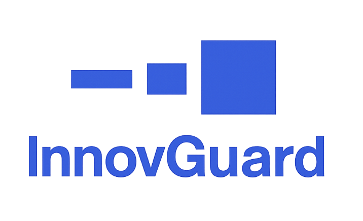

# Awesome AI Security 
用于保护 AI 系统的精选资源、研究与工具。由 [AISecHub](https://www.linkedin.com/groups/14545517/) 管理。**支持方：** [InnovGuard](https://www.innovguard.com/)

[English](README.md) | 简体中文

> 说明：本中文版保留项目官方名称、链接、徽章和排序，以便与英文版对照维护。

   
  <em>技术风险与网络安全咨询 - 自信创新，稳健引领。</em> 
  <a href="https://calendly.com/innovguard/meeting"><strong>预约会议</strong></a>

---

## 目录

- [最佳实践、框架与控制](#best-practices-frameworks--controls)
  - [治理与管理框架](#governance--management-frameworks)
  - [控制与验证标准](#controls--verification-standards)
  - [实施指南与模式](#implementation-guides--patterns)
  - [测试、评估与红队](#testing-evaluation--red-teaming)
  - [智能体系统 -（标准、治理与模式](#agentic-systems-standards-governance--patterns)
  - [威胁建模](#threat-modeling)
  - [策略模板](#policy-templates)
  - [工具包与自评估](#toolkits--self-assessments)
  - [关键基础设施](#critical-infrastructure)
- [工具](#tools)
- [模型](#models)
- [研究工作组](#research-working-groups)
- [攻击与防御矩阵](#attack--defense-matrices)
- [检查清单](#checklists)
- [通讯](#newsletter)
- [数据集](#datasets)
  - [钓鱼](#phishing)
  - [网络安全知识](#cybersecurity-knowledge)
  - [安全编码与漏洞检测](#secure-coding--vulnerability-detection)
  - [深度伪造](#deepfake)
  - [越狱](#jailbreak)
  - [提示注入](#prompt-injection)
  - [系统提示词](#system-prompts)
- [课程与认证](#courses--certifications)
- [培训](#training)
- [报告与研究](#reports-and-research)
  - [供应商报告](#vendor-reports)
  - [研究论文](#research-papers)
  - [研究动态](#research-feed)
- [报告](Reports.zh-CN.md)
- [图书](#books)
- [社区与社群](#communities--social-groups)
- [基准测试](#benchmarking)
- [事件响应](#incident-response)
  - [事件仓库、跟踪器与监测器](#incident-repositories-trackers--monitors)
  - [公开披露漏洞](#publicly-disclosed-vulnerabilities)
  - [指南与行动手册](#guides--playbooks)
- [供应链安全](#supply-chain-security)
- [视频与播放列表](#videos--playlists)
- [会议](Conferences.zh-CN.md)
- [基础：术语表、SoK/综述与分类法](#foundations-glossary-soksurveys--taxonomies)
- [播客](#podcasts)
- [市场图谱](#market-landscape)
- [博客](#blogs)
  - [行业专家](#industry-leaders)
  - [初创公司博客](#startup-blogs)
- [相关 Awesome 清单](#related-awesome-lists)
- [常见缩写](#common-acronyms)

---

## 最佳实践、框架与控制

### 治理与管理框架
- [NIST - AI Risk Management Framework (AI RMF)](https://www.nist.gov/itl/ai-risk-management-framework)
- [ISO/IEC 42001 (AI Management System)](https://www.iso.org/standard/81230.html)
- [OWASP - AI Maturity Assessment (AIMA)](https://github.com/OWASP/www-project-ai-maturity-assessment) 
- [Google - Secure AI Framework (SAIF)](https://saif.google/)
- [OWASP - LLM & GenAI Security Center of Excellence (CoE) Guide](https://genai.owasp.org/resource/llm-and-generative-ai-security-center-of-excellence-guide/)
- [CSA - AI Model Risk Management Framework](https://cloudsecurityalliance.org/artifacts/ai-model-risk-management-framework)
- [NIST - Artificial Intelligence Risk Management Framework: Generative Artificial Intelligence Profile](https://nvlpubs.nist.gov/nistpubs/ai/NIST.AI.600-1.pdf)
- [AI Security Shared Responsibility Model](https://github.com/mikeprivette/ai-security-shared-responsibility) 

### 控制与验证标准
- [OWASP - LLM Security Verification Standard (LLMSVS)](https://github.com/OWASP/www-project-llm-verification-standard) 
- [OWASP - Artificial Intelligence Security Verification Standard (AISVS)](https://github.com/OWASP/AISVS) 
- [CSA - AI Controls Matrix (AICM)](https://cloudsecurityalliance.org/artifacts/ai-controls-matrix) - AICM 包含 18 个领域的 243 个控制目标，并映射到 ISO 42001、ISO 27001、NIST AI RMF 1.0 和 BSI AIC4；可免费下载。

#### Top 10 清单
- [OWASP - Top 10 for Large Language Model Applications](https://github.com/OWASP/www-project-top-10-for-large-language-model-applications) 
- [CSA - MCP Client Top 10](https://modelcontextprotocol-security.io/top10/client/) 
- [CSA - MCP Server Top 10](https://modelcontextprotocol-security.io/top10/server/)
- [OWASP Top 10 for Agentic Applications](https://genai.owasp.org/resource/owasp-top-10-for-agentic-applications-for-2026/) — 全球同行评审框架，用于识别自主式和智能体 AI 系统的关键安全风险，并为复杂工作流中的 AI 智能体安全提供实用指导。

#### 评分与评级体系
- [OWASP - Artificial Intelligence Vulnerability Scoring System](https://github.com/OWASP/www-project-artificial-intelligence-vulnerability-scoring-system) 

### 测试、评估与红队
- [OWASP - Red Teaming Guide](https://genai.owasp.org/resource/genai-red-teaming-guide/)
- [OWASP - LLM Exploit Generation](https://genai.owasp.org/resource/owasp-llm-exploit-generation-v1-0-pdf/)
- [CSA - Agentic AI Red Teaming Guide](https://cloudsecurityalliance.org/artifacts/agentic-ai-red-teaming-guide)
- [OWASP AI Testing Guide](https://github.com/OWASP/www-project-ai-testing-guide)  – Guide that provides comprehensive, structured methodologies and best practices for testing artificial intelligence systems.

### 实施指南与模式

- **OWASP**
  - [OWASP - AI Security and Privacy Guide](https://github.com/OWASP/www-project-ai-security-and-privacy-guide) 
  - [OWASP - LLM and Gen AI Data Security Best Practices](https://genai.owasp.org/resource/llm-and-gen-ai-data-security-best-practices/)
- [CSA - Secure LLM Systems: Essential Authorization Practices](https://cloudsecurityalliance.org/artifacts/securing-llm-backed-systems-essential-authorization-practices)
- [OASIS CoSAI - Preparing Defenders of AI Systems](https://github.com/cosai-oasis/ws2-defenders/blob/main/preparing-defenders-of-ai-systems.md) 
- [DoD CIO - AI Cybersecurity Risk Management Tailoring Guide (2025)](https://dodcio.defense.gov/Portals/0/Documents/Library/AI-CybersecurityRMTailoringGuide.pdf) - 面向 AI 系统全生命周期的实用 RMF 裁剪指南；补充 CDAO 的 RAI 工具包。
- [NCSC (UK) - Guidelines for Secure AI System Development](https://www.ncsc.gov.uk/collection/guidelines-secure-ai-system-development) - 端到端安全 AI SDLC（安全设计、开发、部署、安全运行与维护），包括日志/监控和更新管理。
- [SANS – Critical AI Security Guidelines](https://github.com/sans-community/ai-guidelines)  - 面向 AI/LLM 系统安全的控制导向指南，覆盖访问控制、数据保护、推理安全、监控和 GRC 等六个领域。
- [BSI – Security of AI Systems: Fundamentals](https://www.bsi.bund.de/SharedDocs/Downloads/EN/BSI/KI/Security-of-AI-systems_fundamentals.pdf) - 跨行业基础指南，覆盖生命周期威胁模型、对抗性 ML 攻击以及设计、部署、运营基线控制，并包含保证/认证指导。
- [MITRE – SAFE-AI: A Framework for Securing AI-Enabled Systems](https://www.compliancehub.wiki/content/files/2025/07/mitresafeAI.pdf) - 威胁驱动的 AI RMF 覆盖层，将 AI/ATLAS 战术映射到 NIST SP 800-53 控制，列出约 100 个受 AI 影响的控制，并包含评估访谈问答集。
- [NIST - SP 800-218A: Secure Software Development Practices for Generative AI & Dual-Use Foundation Models (SSDF Community Profile)](https://nvlpubs.nist.gov/nistpubs/SpecialPublications/NIST.SP.800-218A.pdf) - 面向生成式 AI 和双用途基础模型的 NIST SSDF 社区画像，在全生命周期加入数据/模型溯源、评估与红队、供应链保证和事件响应等 AI 专属任务。
 
- **NSA - Artificial Intelligence Security Center (AISC)**
  - [Deploying AI Systems Securely (CSI)](https://media.defense.gov/2024/Apr/15/2003439257/-1/-1/0/CSI-DEPLOYING-AI-SYSTEMS-SECURELY.PDF) - 面向外部开发 AI 系统部署/运营的实用运维指南（与 CISA、FBI 和国际伙伴联合发布）；补充 NCSC 安全 AI 开发指南。
  - [AI Data Security: Best Practices for Securing Data Used to Train & Operate AI Systems (CSI)](https://www.nsa.gov/Press-Room/Press-Releases-Statements/Press-Release-View/Article/4192332/nsas-aisc-releases-joint-guidance-on-the-risks-and-best-practices-in-ai-data-se/) - 关于保护 AI 生命周期中训练和运行数据的联合指南。
  - [Content Credentials: Strengthening Multimedia Integrity in the Generative AI Era (CSI)](https://media.defense.gov/2025/Jan/23/2003639157/-1/-1/0/CSI-CONTENT-CREDENTIALS-STRENGTHENING-MULTIMEDIA-INTEGRITY.PDF) - 面向透明媒体的来源证明和持久内容凭证。
  - [Contextualizing Deepfake Threats to Organizations (CSI)](https://media.defense.gov/2023/Sep/12/2003298925/-1/-1/0/CSI-DEEPFAKE-THREATS.PDF) - 针对组织的合成媒体风险、影响和缓解措施。
- **FS-ISAC - Framework of an Acceptable Use Policy for External Generative AI** - 框架式指南（非模板），为输入/输出、访问控制、监控和表述提供*宽松与严格*条款选项。[PDF](https://www.fsisac.com/hubfs/Knowledge/FrameworkOfAnAcceptableUsePolicyForExternalGenerativeAI.pdf)

### 智能体系统（标准、治理与模式）
- [OWASP - Agent Observability Standard (AOS)](https://github.com/OWASP/www-project-agent-observability-standard) 
- [OWASP - Agent Name Service (ANS) for Secure AI Agent Discovery](https://genai.owasp.org/resource/agent-name-service-ans-for-secure-al-agent-discovery-v1-0/)
- [OWASP - Agentic AI - Threats and Mitigations](https://genai.owasp.org/resource/agentic-ai-threats-and-mitigations/)
- [OWASP - Securing Agentic Applications Guide](https://genai.owasp.org/resource/securing-agentic-applications-guide-1-0/)
- [OWASP - State of Agentic AI Security and Governance](https://genai.owasp.org/resource/state-of-agentic-ai-security-and-governance-1-0/)
- [CSA - Secure Agentic System Design: A Trait-Based Approach](https://cloudsecurityalliance.org/artifacts/secure-agentic-system-design)
- [CSA - Agentic AI Identity & Access Management](https://cloudsecurityalliance.org/artifacts/agentic-ai-identity-and-access-management-a-new-approach) - 08/25

### 威胁建模

- **[OWASP - Multi-Agentic System Threat Modeling Guide](https://genai.owasp.org/resource/multi-agentic-system-threat-modeling-guide-v1-0/)** - 将 OWASP 智能体威胁分类法应用于多智能体系统，并通过示例展示如何使用 MAESTRO 框架建模。
- **[AWS - Threat modeling your generative AI workload to evaluate security risk](https://aws.amazon.com/blogs/security/threat-modeling-your-generative-ai-workload-to-evaluate-security-risk/)** - 实用的四问法（在做什么、可能出什么问题、如何应对、是否足够好），包含 DFD、假设、威胁陈述、映射缓解和验证等交付物，并提供示例和 AWS Threat Composer 模板。
- **[Microsoft - Threat Modeling AI/ML Systems and Dependencies](https://learn.microsoft.com/en-us/security/engineering/threat-modeling-aiml)** - 面向 AI/ML 威胁建模的实用指南，包含“关键新考虑”问题和威胁到缓解措施目录，适用于使用或依赖 AI/ML 的产品安全设计评审。

### 策略模板

#### 可接受使用
*面向组织、可直接调整的安全与负责任 AI 策略，覆盖可接受使用、数据分类与处理、隐私/PII 与保留、模型/工具审批、人工介入、归因与内容来源、评估/红队、事件响应以及第三方/供应商风险。*

- [Responsible Artificial Intelligence Institute - AI Policy Template](https://www.aigl.blog/content/files/2025/05/AI-POLICY-TEMPLATE.pdf)
- [ISACA - AI Acceptable Use Policy Template](https://www.isaca.org/resources/artificial-intelligence-acceptable-use-policy-template)

### 工具包与自评估
*用于建立 AI 风险基线、评估第三方并规划改进的实用工作簿和自评估。*

#### 组织成熟度与治理
- **[OWASP - AI Maturity Assessment (AIMA)](https://owasp.org/www-project-ai-maturity-assessment/)** - 组织级成熟度模型和自评估，覆盖治理、安全、隐私和生命周期。([Toolkit](https://raw.githubusercontent.com/OWASP/www-project-ai-maturity-assessment/main/releases/V1/OWASP-AIMA-Toolkit_V1.xlsx) • [Guide](https://github.com/OWASP/www-project-ai-maturity-assessment/blob/main/releases/V1/OWASP-AIMA_V1.pdf))
- **[NIST - AI RMF Playbook](https://www.nist.gov/itl/ai-risk-management-framework/nist-ai-rmf-playbook)** - 映射到 Govern/Map/Measure/Manage 结果的可操作检查清单和建议行动。([Playbook](https://airc.nist.gov/airmf-resources/playbook/))
- **[DoD CDAO - Responsible AI Toolkit (RAI)](https://rai.acqbot.com/executive-summary)** - 面向 AI 项目生命周期（Intake → Use）的自评估工具包，包括 SHIELD 评估、Statements of Concern 工作表、RASCI 指南和精选“RAI Tools List”。([RAI Toolkit](https://rai.acqbot.com/) • [Overview](https://www.ai.mil/Latest/Blog/Article-Display/Article/3940314/responsible-ai-toolkit/))
  > **配合使用：** **[DoD CIO - AI Cybersecurity Risk Management Tailoring Guide (2025)](https://dodcio.defense.gov/Portals/0/Documents/Library/AI-CybersecurityRMTailoringGuide.pdf)** - CIO 指南说明应与 CDAO RAI Toolkit 配套使用。

#### 供应商与第三方风险
- **[FS-ISAC - GenAI Vendor Evaluation & Qualitative Risk Assessment](https://www.fsisac.com/)** - 尽职调查工具包，包含风险分级、问卷和自动生成报告。([Toolkit](https://www.fsisac.com/hubfs/Knowledge/AI/FSISAC_GenerativeAI-VendorEvaluation&QualitativeRiskAssessmentTool.xlsx) • [Guide](https://www.fsisac.com/hubfs/Knowledge/AI/FSISAC_GenerativeAI-VendorEvaluation&QualitativeRiskAssessment.pdf))

#### 隐私与数据保护
- **[UK ICO - AI & Data Protection Risk Toolkit](https://ico.org.uk/for-organisations/uk-gdpr-guidance-and-resources/artificial-intelligence/guidance-on-ai-and-data-protection/ai-and-data-protection-risk-toolkit/)** - Excel workbook to assess risks to individuals’ rights/freedoms from your AI system. ([Toolkit - XLSX](https://ico.org.uk/media2/kr3mveig/ai_and_data_protection_risk_toolkit_v11.xlsx))

#### 威胁驱动的设计评审
- **[OWASP - Threat & Defense Compass](https://genai.owasp.org/resource/owasp-genai-security-project-threat-defense-compass-1-0/)** - maps GenAI risks to concrete mitigations for design reviews and pre-deployment checks. ([Toolkit](https://genai.owasp.org/resource/owasp-genai-security-project-threat-defense-compass-1-0/) • [Guide](https://genai.owasp.org/resource/owasp-genai-security-project-threat-defense-compass-runbook/))

#### 监管与合规评估
- **[EU - ALTAI Self-Assessment](https://digital-strategy.ec.europa.eu/en/library/assessment-list-trustworthy-artificial-intelligence-altai-self-assessment)** - checklist translating EU Trustworthy-AI principles into practice. ([Checklist - PDF](https://data.europa.eu/doi/10.2759/002360))
- **[Canada - Algorithmic Impact Assessment (AIA)](https://www.canada.ca/en/government/system/digital-government/digital-government-innovations/responsible-use-ai/algorithmic-impact-assessment.html)** - mandatory questionnaire for Canadian federal use of automated decision systems; determines impact level and mitigations.  
- **[Singapore - AI Verify](https://www.imda.gov.sg/about-imda/emerging-technologies-and-research/artificial-intelligence)** - governance testing framework + software toolkit for self-assessment and reporting. ([Repo](https://github.com/aiverify-foundation/aiverify))
- **[OECD - AI System Classification Framework](https://oecd.ai/en/classification)** - tool to characterise systems across policy-relevant dimensions to surface risks and controls. ([Guide - PDF](https://www.oecd.org/content/dam/oecd/en/publications/reports/2022/02/oecd-framework-for-the-classification-of-ai-systems_336a8b57/cb6d9eca-en.pdf))

#### 控制目录与映射（用于差距评估）
- **[CSA - AI Controls Matrix (AICM)](https://cloudsecurityalliance.org/artifacts/ai-controls-matrix)** - 243 control objectives across 18 domains, mapped to ISO/IEC 42001, NIST AI RMF, etc.
- **[BSI - AIC4 (AI Cloud Service Compliance Criteria Catalogue)](https://www.bsi.bund.de/SharedDocs/Downloads/EN/BSI/CloudComputing/AIC4/AI-Cloud-Service-Compliance-Criteria-Catalogue_AIC4.pdf?__blob=publicationFile&v=4)** - criteria to evaluate security/robustness, performance, reliability, data quality/management, explainability, and bias for AI cloud services.

#### 影响评估（项目/系统层面）
- **[Microsoft - Responsible AI Impact Assessment](https://msblogs.thesourcemediaassets.com/sites/5/2022/06/Microsoft-RAI-Impact-Assessment-Guide.pdf)** - guidance and template for assessing potential impacts on people, orgs, and society. ([Guide](https://msblogs.thesourcemediaassets.com/sites/5/2022/06/Microsoft-RAI-Impact-Assessment-Guide.pdf) • [Template](https://msblogs.thesourcemediaassets.com/sites/5/2022/06/Microsoft-RAI-Impact-Assessment-Template.pdf))
- **[TrustArc - AI Risk Assessment](https://trustarc.com/resource/ai-risk-assessment/)** - self-assessment to kick off trustworthy-AI evaluations across ethics, safety, security, and societal considerations.

### 关键基础设施
- [DHS/CISA - Safety & Security Guidelines for Critical Infrastructure AI](https://www.dhs.gov/publication/safety-and-security-guidelines-critical-infrastructure-owners-and-operators) - Cross-lifecycle guidance for owners/operators (govern, design, develop, deploy, operate); developed with SRMAs and informed by CISA’s cross-sector risk analysis.
  
---

## [↑](#table-of-contents)工具 
*收录标准（开源工具）：必须有 **220+ GitHub stars**、**过去 12 个月内仍在维护**，且 **≥3 名贡献者**。*

### 凭据隔离与智能体访问控制
*通过确保 AI 智能体永不直接访问原始 API 密钥来防止凭据外泄；在请求时通过代理网关注入密钥。*

- **[OneCLI](https://github.com/onecli/onecli)**  – Open-source credential vault for AI agents. Rust HTTP gateway intercepts agent requests and injects API credentials transparently; AES-256-GCM encryption, per-agent scoped tokens, full audit trail.

### 提示注入检测与缓解
*在输入、上下文和输出中检测并阻止直接/间接提示注入；在恶意内容到达工具或模型前进行过滤。*

- *(当前列表暂无)* -

### 越狱与策略执行（护栏）
*通过规则、验证器或 DSL 在运行时执行安全策略并阻止越狱；敏感操作可加入人工介入。*

- **[NeMo Guardrails](https://github.com/NVIDIA/NeMo-Guardrails)** 
- **[LLM Guard](https://github.com/protectai/llm-guard)** 
- **[Llama Guard](https://github.com/meta-llama/PurpleLlama/tree/main/Llama-Guard4)** 
- **[LlamaFirewall](https://github.com/meta-llama/PurpleLlama/tree/main/LlamaFirewall)** 
- **[Code Shield](https://github.com/meta-llama/PurpleLlama/tree/main/CodeShield)** 
- **[Guardrails](https://github.com/guardrails-ai/guardrails)**  - Runtime policy enforcement for LLM apps: compose input/output validators (PII, toxicity, jailbreak/PI, regex, competitor checks), then block/redact/rewrite/retry on fail; optional server mode; also supports structured outputs (Pydantic/function-calling).

### 模型工件扫描器
*分析序列化模型文件中的不安全反序列化和嵌入代码；验证完整性/元数据，失败时阻止或隔离。*

- **[ModelScan](https://github.com/protectai/modelscan)** 
- **[Fickling](https://github.com/trailofbits/fickling)** 
- **[picklescan](https://github.com/mmaitre314/picklescan)** 

### 模型识别与溯源（指纹识别）
*Black-box fingerprinting to identify the underlying LLM/version behind an application or API and to support provenance verification, useful for model discovery, access control (allowlists), vendor due diligence, incident response, and audits.*

- **[LLMmap](https://github.com/pasquini-dario/LLMmap)**  – Active, black-box LLM fingerprinting: sends crafted probes to a target and classifies the underlying model/version; includes CLI and scripts.
- **[TRAP (Targeted Random Adversarial Prompt)](https://github.com/parameterlab/trap)**  – Black-box identification using targeted adversarial prompts to elicit model-specific behaviors; reference implementation from the paper.

### 逆向工程
*用于安全分析的 LLM 辅助反编译与重建（恶意软件分诊、DFIR、漏洞研究）。*

- **[LLM4Decompile](https://github.com/albertan017/LLM4Decompile)**   Its current version supports decompiling Linux x86_64 binaries, ranging from GCC's O0 to O3 optimization levels, into human-readable C source code. Our team is committed to expanding this tool's capabilities, with ongoing efforts to incorporate a broader range of architectures and configurations. ([blog](https://www.joshuamckiddy.com/blog/using-llms-for-reverse-engineering-and-malware-analysis), [arxiv](https://arxiv.org/html/2403.05286v2)).

### 智能体工具与 MCP 安全
*Scan/audit MCP servers & client configs; detect tool poisoning, unsafe flows; constrain tool access with least-privilege and audit trails.*

#### 蜜罐与欺骗（MCP/LLM）

- **[Beelzebub](https://github.com/mariocandela/beelzebub)**  - Beelzebub is a honeypot framework designed to provide a secure environment for detecting and analyzing cyber attacks. It offers a low code approach for easy implementation and uses AI to mimic the behavior of a high-interaction honeypot.

#### 工具清单/元数据验证器

- **[mcp-scan](https://github.com/invariantlabs-ai/mcp-scan)** 

#### 智能体身份与信任

#### 服务器与开发工具

- **[PortSwigger - MCP Server](https://github.com/PortSwigger/mcp-server)** 
- **[ToolHive](https://github.com/stacklok/toolhive)**  - MCP server orchestrator for desktop, CLI, and Kubernetes Operator: discover and deploy servers in isolated containers with restricted permissions, manage secrets, use an optional egress proxy, auto-configure popular MCP clients (e.g., GitHub Copilot, Cursor), and manage at scale via CRDs/registry.

### 智能体代码执行沙箱
*在隔离沙箱中运行不受信任或由 LLM 触发的代码（文件系统/网络/进程限制），以遏制 RCE 并降低影响范围。*

- **[E2B](https://github.com/e2b-dev/E2B)**  - SDK + self-hostable infra to run untrusted, LLM-generated code in isolated cloud sandboxes (Firecracker microVMs).

- **[microsandbox](https://github.com/microsandbox/microsandbox)**  - self-hosted microVM (libkrun) sandbox for untrusted AI/user code.

### 机密且可验证的推理（PCC/TEE）
*在经过证明的 TEE 中运行 AI 模型，提供端到端加密、可审计性和不可关联请求，使提示和输出不离开安全边界。*

- **[Phala](https://phala.com/)** ([Docs](https://docs.phala.network/) • [GitHub](https://github.com/Phala-Network/phala-cloud)) — Confidential AI cloud platform running LLMs and AI workloads in GPU TEEs (NVIDIA H100/H200). Features hardware attestation, verifiable inference, and Docker-based deployment with zero code changes. Supports both CPU TEE (Intel TDX) and GPU TEE for confidential AI at scale.
- **[dstack](https://github.com/dstack-TEE/dstack)**  — Open-source SDK for building TEE-based confidential applications. Provides Docker-to-TEE deployment, remote attestation, secure key management, and TLS termination inside enclaves. Works with Intel TDX and NVIDIA GPU TEEs.
- **[OpenPCC](https://github.com/openpcc/openpcc) ** — Open-source framework for provably private AI inference (encrypted streaming, hardware attestation, unlinkable requests), inspired by Apple's PCC and deployable on your own infra. 

### 网关与策略代理
*在所有模型/提供方之间集中认证、配额/速率限制、成本上限、出口/DLP 过滤和护栏编排。*

- **[Cerbos](https://github.com/cerbos/cerbos)**  – open-source, policy-based authorization layer for fine-grained controls in MCP servers, RAG pipelines, and other agentic systems.

### 代码审查
- **[Claude Code Security Reviewer](https://github.com/anthropics/claude-code-security-review)**  - An AI-powered security review GitHub Action using Claude to analyze code changes for security vulnerabilities.
- **[Vulnhuntr](https://github.com/protectai/vulnhuntr)**  - Vulnhuntr leverages the power of LLMs to automatically create and analyze entire code call chains starting from remote user input and ending at server output for detection of complex, multi-step, security-bypassing vulnerabilities that go far beyond what traditional static code analysis tools are capable of performing.
  
### 红队测试框架与自动化安全测试
*在 CI 中自动运行攻击套件（提示注入、泄露、越狱、目标型任务），评分并生成回归证据。*

#### 集成平台
- **[AI-Infra-Guard](https://github.com/Tencent/AI-Infra-Guard)**  - AI red-teaming platform: AI infra vulnerability scan (30+ components, ~400 CVEs), MCP server risk scan (9 categories), and jailbreak evaluation; web UI + Docker quick start.

#### 提示注入测试套件
- **[Promptmap](https://github.com/utkusen/promptmap)** 
- **[Giskard](https://github.com/Giskard-AI/giskard)** 

#### 数据泄露/密钥外泄测试套件
- **[garak](https://github.com/NVIDIA/garak)** 
- **[Agentic Security](https://github.com/msoedov/agentic_security)** 

#### 越狱目录与对抗提示
- **[FuzzyAI](https://github.com/cyberark/FuzzyAI)** 
- **[GPTFuzz](https://github.com/sherdencooper/GPTFuzz)** 

#### 对抗鲁棒性（规避）工具包
- **[TextAttack](https://github.com/QData/TextAttack)** 
- **[Foolbox](https://github.com/bethgelab/foolbox)** 

#### 目标导向的智能体攻击任务
- **[PyRIT](https://github.com/Azure/PyRIT)** 
- **[AgentDojo](https://github.com/ethz-spylab/agentdojo)** 
- **[PentestGPT](https://github.com/GreyDGL/PentestGPT)** 
- **[CAI - Cybersecurity AI](https://github.com/aliasrobotics/cai)**  
- **[hackingBuddyGPT](https://github.com/ipa-lab/hackingBuddyGPT)** 
- **[HexStrike AI](https://github.com/0x4m4/hexstrike-ai)** 
- **[Nebula](https://github.com/berylliumsec/nebula)** 

#### CI 流水线与回归门禁
- **[promptfoo](https://github.com/promptfoo/promptfoo)** 
- **[Agentic Radar](https://github.com/splx-ai/agentic-radar)** 
- **[DeepTeam](https://github.com/confident-ai/deepteam)** 
- **[Buttercup](https://github.com/trailofbits/buttercup)**  - Trail of Bits’ AIxCC Cyber Reasoning System: runs OSS-Fuzz-style campaigns to find vulns, then uses a multi-agent LLM patcher to generate & validate fixes for C/Java repos; ships SigNoz observability; requires at least one LLM API key.
- **[Giskard](https://github.com/Giskard-AI/giskard-oss)**  - Pre-deployment/CI evaluation harness for LLM/RAG: runs scan checks (prompt injection, harmful output, sensitive-information disclosure, robustness), auto-generates RAG evaluation datasets and component scores (retriever, generator, rewriter, router), exports shareable reports, and integrates with CI for regression gates.
- **[ultraprobe](https://github.com/ppcvote/ultralab/tree/master/ultraprobe)**  - Lighthouse-style CLI for AI agents: bundles prompt defense audit (17 vectors), PII detection, and SEO/AEO/AAO scanners into a single AVS Score. Pure deterministic, zero-config, MIT-licensed. Designed for CI gates and pre-deployment scoring.

#### 评分/排行榜与证据报告
- *(none from your current list yet)*

### 供应链：AI/ML BOM 与证明
*生成并验证模型、数据集和依赖的 AI/ML BOM、签名与来源证明，并执行允许/拒绝策略。*

- *(none from your current list yet)*

### 向量/记忆存储安全
*加固 RAG 记忆：隔离命名空间，清洗查询/内容，检测投毒/离群值，并防止保留密钥或 PII。*

- *(none from your current list yet)*

### 数据/模型投毒防御
*检测并缓解数据集/模型投毒和后门；验证训练/微调完整性，并剪除可疑行为。*

- **[Adversarial Robustness Toolbox (ART)](https://github.com/Trusted-AI/adversarial-robustness-toolbox)** 

### 敏感数据泄露防护（AI DLP）
*通过检测、脱敏和 I/O 边界策略检查，防止提示词/输出中的密钥或 PII 外泄。*

- **[Presidio](https://github.com/microsoft/presidio)**  - PII/PHI detection & redaction for text, images, and structured data; use as a pre/post-LLM DLP filter and for dataset sanitization.

### 监控、日志与异常检测
*收集 AI 专属安全日志/信号，检测滥用模式（提示注入/越狱/泄露），丰富告警并支持取证。*

- **[LangKit](https://github.com/whylabs/langkit)**  - LLM observability metrics toolkit (whylogs-compatible): prompt-injection/jailbreak similarity, PII patterns, hallucination/consistency, relevance, sentiment/toxicity, readability.

- **[Alibi Detect](https://github.com/SeldonIO/alibi-detect)**  - Production drift/outlier/adversarial detection for tabular, text, images, and time series; online/offline detectors with TF/PyTorch backends; returns scores, thresholds, and flags for alerting.

---

## [↑](#table-of-contents)攻击与防御矩阵 
*矩阵式资源，覆盖 AI 系统的对抗性 TTP 和精选防御技术。*

### 攻击
- [MITRE ATLAS](https://atlas.mitre.org) - Adversarial TTP matrix and knowledge base for threats to AI systems.
- [GenAI Attacks Matrix](https://ttps.ai/matrix.html#genai-attacks-matrix) - Matrix of TTPs targeting GenAI apps, copilots, and agents.
- [MCP Security Tactics, Techniques, and Procedures (TTPs)](https://modelcontextprotocol-security.io/ttps/)

### 防御
- [AIDEFEND - AI Defense Framework](https://github.com/edward-playground/aidefense-framework)  - Interactive defensive countermeasures knowledge base with Tactics / Pillars / Phases views; maps mitigations to MITRE ATLAS, MAESTRO, and OWASP LLM risks. • **Live demo:** https://edward-playground.github.io/aidefense-framework/

---

## [↑](#table-of-contents)检查清单 

- [OWASP - LLM Applications Cybersecurity & Governance Checklist](https://genai.owasp.org/resource/llm-applications-cybersecurity-and-governance-checklist-english/)
- [SlowMist - MCP Security Checklist](https://github.com/slowmist/MCP-Security-Checklist) 

---

## [↑](#table-of-contents)供应链安全 
用于保护 AI/ML 软件供应链（模型、数据集、代码、流水线）的指南与标准。以规范和框架为主，并包含经筛选的 TPRM 模板。

### 标准与规范
*面向 AI 组件和依赖透明度与可追溯性的规范格式和规格。*

- **OWASP - AI Bill of Materials (AIBOM)**  - Bill of materials format for AI components, datasets, and model dependencies.

### 第三方评估
*用于评估外部供应商、模型提供方和集成商在安全、隐私与合规方面表现的问卷和模板。*

- **FS-ISAC - Generative AI Vendor Evaluation & Qualitative Risk Assessment** - [Assessment Tool XLSX](https://www.fsisac.com/hubfs/Knowledge/AI/FSISAC_GenerativeAI-VendorEvaluation&QualitativeRiskAssessmentTool.xlsx) • [Guide PDF](https://www.fsisac.com/hubfs/Knowledge/AI/FSISAC_GenerativeAI-VendorEvaluation&QualitativeRiskAssessment.pdf) - Vendor due-diligence toolkit for GenAI: risk tiering by use case, integration and data sensitivity; questionnaires across privacy, security, model development and validation, integration, legal and compliance; auto-generated reporting.

---

## [↑](#table-of-contents)视频与播放列表 
*每月精选的 AI 安全演讲、演示、事件和工具播放列表。*

- **[AI Security Playlist - September 2025](https://www.youtube.com/playlist?list=PLFO56KBxdGBeEmDZTbjZtkVEfhBAXQDZt)**
- **[AI Security Playlist - August 2025](https://www.youtube.com/playlist?list=PLFO56KBxdGBeqkXsyIXWCRkB7gFrEqaER)**
- **[AI Security Playlist - July 2025](https://www.youtube.com/playlist?list=PLFO56KBxdGBfcknOAnHJFYlld2FoLsbre)**
- **[AI Security Playlist - June 2025](https://www.youtube.com/playlist?list=PLFO56KBxdGBfOiusdf-YV6e8WBWgAwe-4)**

---

## [↑](#table-of-contents)通讯 
- [Adversarial AI Digest](https://www.linkedin.com/newsletters/adversarial-ai-digest-7298813894498598912/) - A digest of AI security research, threats, governance challenges, and best practices for securing AI systems.

---

## [↑](#table-of-contents)数据集 

### 数据集索引与门户

- **[Kaggle](https://www.kaggle.com/datasets?search=cybersecurity)** - Community-contributed datasets (IDS, phishing, malware URLs, incidents).
- **[Hugging Face](https://huggingface.co/datasets?search=cybersecurity)** - Search HF datasets tagged/related to cybersecurity and threat intel.
- **[SafetyPrompts](https://safetyprompts.com/)** - living index of LLM safety datasets & evals (jailbreak, prompt injection, toxicity, privacy), with filters and a maintained sheet.
- **[Awesome Cybersecurity Datasets](https://github.com/shramos/Awesome-Cybersecurity-Datasets)** 

### 网络安全技能
交互式 CTF 和自包含实验，用于训练 Web、pwn、密码学、取证和逆向等实战安全技能。**用于**评估实践推理、工具使用和端到端任务执行能力。

#### CTF 挑战

- **[InterCode-CTF](https://intercode-benchmark.github.io/)**  - 100 picoCTF challenges (high-school level); categories: cryptography, web, binary exploitation (pwn), reverse engineering, forensics, miscellaneous. [Dataset+Benchmark] [arXiv](https://arxiv.org/abs/2306.14898)
- **[NYU CTF Bench](https://nyu-llm-ctf.github.io/)**  - 200 CSAW challenges (2017-2023); difficulty very easy → hard; categories: cryptography, web, binary exploitation (pwn), reverse engineering, forensics, miscellaneous. [Dataset+Benchmark] [arXiv](https://arxiv.org/abs/2406.05590)
- **[CyBench](https://cybench.github.io/)**  - 40 tasks from HackTheBox, Sekai CTF, Glacier, HKCert (2022-2024); categories: cryptography, web, binary exploitation (pwn), reverse engineering, forensics, miscellaneous; difficulty grounded by first-solve time (FST). [Dataset+Benchmark] [arXiv](https://arxiv.org/abs/2408.08926)
- **[pwn.college CTF Archive](https://github.com/pwncollege/ctf-archive)**  - large collection of runnable CTF challenges; commonly used as a source corpus for research. [Dataset]

#### 安全代码

##### 检测
- **[Devign / CodeXGLUE-Vul](https://github.com/saikat107/Devign)**  - function-level C vuln detection. [Dataset+Benchmark]
- **[DiverseVul](https://github.com/wagner-group/diversevul)**  - multi-CWE function-level detection (C/C++). [Dataset]
- **[Big-Vul](https://github.com/ZeoVan/MSR_20_Code_vulnerability_CSV_Dataset)**  - real-world C/C++ detection (often with localization). [Dataset]
- **[Py150k](https://huggingface.co/datasets/AISE-TUDelft/PY150k)**  - 约 15 万个来自 GitHub 的 Python 片段（已去重、可 AST 解析、宽松许可）。**用于：**通用代码模型预训练/微调（如 CodeGen、CodeGen2/2.5、CodeLlama、CrystalCoder、CodeT5+）；不是带漏洞标签的数据集。[Dataset]

##### 生成代码安全（LLM 代码生成评估）
- **[LLMSecEval](https://github.com/tuhh-softsec/LLMSecEval)**  - 映射到 CWE 和安全参考实现的提示集合；对每个提示生成代码，并用静态分析（如 CodeQL / Semgrep / Bandit）标注安全/易受攻击输出并计算按 CWE 的指标。**用于：**生成代码安全基准测试。[Dataset] [arXiv](https://arxiv.org/abs/2303.09384)

##### 修复与补丁挖掘
- **[CVEfixes](https://github.com/secureIT-project/CVEfixes)**  - CVE-linked fix commits for security repair. [Dataset]
- Also used for repair: Big-Vul (generate minimal diffs, then build + scan).

##### 可运行/扫描器评估
- **[OWASP Benchmark (Java)](https://github.com/OWASP-Benchmark/BenchmarkJava)**  - runnable Java app with seeded vulns; supports SAST/DAST/IAST evaluation and scoring. [Dataset+Benchmark]
- **[Juliet Test Suite (C/C++)](https://github.com/arichardson/juliet-test-suite-c)**  - runnable CWE cases for detect → fix → re-test. [Test Suite (benchmark-ready)]
- **[Juliet Test Suite (Java)](https://github.com/UnitTestBot/juliet-java-test-suite)**  - runnable CWE cases for detect → fix → re-test. [Test Suite (benchmark-ready)]
- **[NIST SARD - Software Assurance Reference Dataset](https://samate.nist.gov/SARD/)** - Labeled vulnerable/benign code datasets: >450k test cases (C/C++/Java/PHP/C#), 150+ CWEs; includes Juliet v1.3 (C/C++ 64,099 · Java 28,881 · C# 28,942 cases).

### 钓鱼
> 钓鱼数据集缺口：目前缺少按页面保存 URL、完整 HTML/CSS/JS、图片、favicon 和截图的公开语料库。多数来源只是 URL feed，页面消失很快，旧基准会漂移，模型泛化较差。建议按 URL 归档所有页面资源，同时注意截图仅覆盖视口，且部分资产可能被浏览器安全机制阻止。

- **[PhishTank](https://phishtank.org/)** - Continuously updated dataset (API/feed); community-verified phishing URLs; labels zero-day phishing; offers webpage screenshots. 
- **[OpenPhish](https://openphish.com/)** - Regularly updated phishing URLs with fields such as webpage info, hostname, supported language, IP presence, country code, and SSL certificate; includes brand-target stats.
- **[PhreshPhish](https://huggingface.co/datasets/phreshphish/phreshphish)** - 372k HTML–URL samples (119k phishing / 253k benign) with full-page HTML, URLs, timestamps, and brand targets (~185 brands) across 50+ languages; suitable for training and evaluating URL/page-based phishing detection.
- **[Phishing.Database](https://github.com/Phishing-Database/Phishing.Database)** - Continuously updated lists of phishing domains/links/IPs (ACTIVE/INACTIVE/INVALID and NEW last hour/today); repo resets daily-download lists; status validated via PyFunceble.
- **[UCI – Phishing Websites](https://archive.ics.uci.edu/ml/datasets/phishing+websites)** - 11,055 URLs (phishing and legitimate) with 30 engineered features across URL, content, and third-party signals.
- **[Mendeley – Phishing Websites Dataset](https://data.mendeley.com/datasets/n96ncsr5g4)** - Labeled phishing/legitimate samples; provides webpage content (HTML) for each URL.; useful for training/eval.
- **[UCI – PhiUSIIL Phishing URL](https://archive.ics.uci.edu/dataset/967/phiusiil%2Bphishing%2Burl%2Bdataset)** - 235,795 URLs (134,850 legitimate; 100,945 phishing) with 54 URL/content features; labels: Class 1 = legitimate, Class 0 = phishing.
- **[MillerSmiles](https://www.millersmiles.co.uk/)** - Large archive of phishing email scams with the URLs used; long-running email corpus (not a live feed).

### 网络安全知识
用于评估安全知识和术语的结构化问答数据集。**用于**评估事实记忆和概念理解。

- **[CyberMetric](https://github.com/cybermetric/CyberMetric)**  - 10k MCQs via RAG from standards/books/RFCs; subsets (80/500/2k/10k).

- **[SecEval](https://huggingface.co/datasets/XuanwuAI/SecEval)**   - ~2k MCQs across 9 domains; eval kit and leaderboard on GitHub.

- **[AttackQA](https://huggingface.co/datasets/sambanovasystems/attackqa)**  - 25,335 SOC/MITRE ATT&CK-grounded Q&A with rationales.

- **[SECQA](https://huggingface.co/datasets/zefang-liu/secqa)**  - 242 MCQs (v1: 127, v2: 115), GPT-4–generated from one textbook; good for quick probes.
 
### 安全编码与漏洞检测
标注为易受攻击或安全的代码片段数据集，通常关联 CWE（Common Weakness Enumeration）。**用于**评估模型识别不安全代码模式并建议安全修复的能力。

- **[SecCodePLT](https://huggingface.co/datasets/Virtue-AI-HUB/SecCodePLT)** 

- **[Py150k](https://huggingface.co/datasets/AISE-TUDelft/PY150k)**  - 约 15 万个来自 GitHub 的 Python 文件（已去重/移除 fork）；Bandit、Semgrep、Snyk 静态分析在 26,147 个片段中识别出 42,753 个漏洞，常见 CWE 包括 XSS、SQLi、输入验证不当、OS 命令注入和信息暴露。用于训练和微调代码模型。

- **[PrimeVul](https://github.com/DLVulDet/PrimeVul)**  – Combines [BigVul](https://github.com/ZeoVan/MSR_20_Code_vulnerability_CSV_Dataset), [CrossVul](https://zenodo.org/records/4734050), [CVEfixes](https://github.com/secureIT-project/CVEfixes), and [DiverseVul](https://github.com/wagner-group/diversevul); de-duplicated and commit-filtered for high-quality labels; temporal train/val/test split by commit time. 224,533 functions from 755 open-source projects; 6,062 vulnerable; broad CWE coverage. ([arXiv](https://arxiv.org/abs/2403.18624))

- **[CredData (Samsung)](https://github.com/Samsung/CredData)**  - Labeled dataset of credential-like code lines flagged by scanners, with human GroundTruth (T/F/X) + metadata for benchmarking secret scanners.
- 
### 恶意软件行为与动态分析

- **[Avast–CTU Public CAPEv2 Dataset](https://github.com/avast/avast-ctu-cape-dataset)**  - 48,976 份沙箱 JSON 报告（CAPEv2），覆盖 10 个家族（Adload、Emotet、HarHar、Lokibot、njRAT、Qakbot、Swisyn、Trickbot、Ursnif、Zeus）；每个样本包含 `sha256`、家族、类型和检测日期等元数据。提供 Full（约 13 GB）和 Reduced（约 566 MB）两个版本。**用于：**基于行为的恶意软件分类和概念漂移研究。 - [arXiv](https://arxiv.org/abs/2209.03188)

### 深度伪造

#### 音频（语音）深度伪造

- [**ASVspoof 5 - train / dev / eva**l](https://doi.org/10.5281/zenodo.14498691) - Train: 8 TTS attacks; Dev: 8 unseen (validation/fusion); Eval: 16 unseen incl. adversarial/codec. Labels: `bona-fide` / `spoofed`. [arXiv](https://www.asvspoof.org/)
- [**In-the-Wild (ITW)**](https://deepfake-total.com/in_the_wild) - 58 politicians/celebrities with per-speaker pairing; ≈20.7 h `bona-fide` + 17.2 h `spoofed`, scraped from social/video platforms. Labels: `bona-fide` / `spoofed`. [arXiv](https://arxiv.org/abs/2203.16263)
- [**MLAAD (+M-AILABS)**](https://deepfake-total.com/mlaad) - Multilingual synthetic TTS corpus (hundreds of hours; many models/languages). Labels: `bona-fide` (M-AILABS) / `spoof` (MLAAD). [arXiv](https://arxiv.org/abs/2401.09512)
- [**LlamaPartialSpoof**](https://zenodo.org/records/14214149) - LLM-driven attacker styles; includes full and partial (spliced) spoofs. Labels: `bona-fide` / `fully-spoofed` / `partially-spoofed`. [arXiv](https://arxiv.org/abs/2409.14743)
- [**Fake-or-Real (FoR)**](https://bil.eecs.yorku.ca/datasets/) - >195k utterances; four variants: `for-original`, `for-norm`, `for-2sec`, `for-rerec`. Labels: `real` / `synthetic`.
- [**CodecFake**](https://codecfake.github.io/) - codec-based deepfake audio dataset (Interspeech 2024); Labels: `real` / `codec-generated fake`. [arXiv](https://arxiv.org/abs/2405.04880)

#### 视频深度伪造

### 越狱
对抗提示数据集，包括纯文本和多模态形式，用于绕过安全机制或测试拒答逻辑。
**用于**测试模型抵抗越狱并执行基于策略拒答的效果。

- **[CySecBench](https://github.com/cysecbench/dataset)**   cybersecurity-domain jailbreak dataset with 12,662 close-ended prompts across multiple attack categories; paper introduces an obfuscation-based jailbreaking method and LLM evals.
- **[JailBreakV-28K](https://github.com/SaFoLab-WISC/JailBreakV_28K)**   multimodal jailbreak benchmark with ~28k test cases (20k text-based transfer attacks + 8k image-based) to assess MLLM robustness; HF page includes a mini-leaderboard and image types. 
- **[Do-Not-Answer](https://github.com/Libr-AI/do-not-answer)**   refusal-evaluation set of 939 “should-refuse” prompts plus an automatic evaluator; answering instead of refusing can be used as a jailbreak-success signal. 

### 提示注入
*公开提示注入数据集存在一些反复出现的限制：随着模型和防御演进会部分过时，CTF 数据偏向基础指令遵循，且毒性、越狱角色扮演和真实注入标签混杂，可能抬高测得的真阳性率并扭曲评估。*

- **[prompt-injection-attack-dataset](https://huggingface.co/datasets/xxz224/prompt-injection-attack-dataset)** 3.7k rows pairing benign task prompts with attack variants (naive / escape / ignore / fake-completion / combined). Columns for both target and injected tasks; train split only.
- **[prompt-injections-benchmark](https://huggingface.co/datasets/qualifire/prompt-injections-benchmark)**  5,000 prompts labeled `jailbreak` / `benign` for robustness evals. 
- **[prompt_injections](https://huggingface.co/datasets/yanismiraoui/prompt_injections)**  ~1k short injection prompts; multilingual (EN, FR, DE, ES, IT, PT, RO); single `train` split; CSV/Parquet.
- **[prompt-injection](https://huggingface.co/datasets/jayavibhav/prompt-injection)**  Large-scale injection/benign corpus (~327k rows, `train/test`) for training baselines and detectors.
- **[prompt-injection-safety](https://huggingface.co/datasets/jayavibhav/prompt-injection-safety)**  60k rows (`train` 50k / `test` 10k); 3-way labels: benign `0`, injection `1`, harmful request `2`; Parquet.

## 系统提示词
> 泄露、官方和合成系统提示词及配对响应集合，用于研究护栏并识别系统提示词暴露。**用于**构建泄露检测器、设计定向护栏测试（同意门、工具使用规则、安全策略），以及复现供应商行为以进行评估。

- [**Official_LLM_System_Prompts**](https://huggingface.co/datasets/Nymbo/Official_LLM_System_Prompts) ) - leaked and date-stamped prompts from proprietary assistants (OpenAI, Anthropic, MS Copilot, GitHub Copilot, Grok, Perplexity); 29 rows.
- [**system-prompt-leakage**](https://huggingface.co/datasets/gabrielchua/system-prompt-leakage) ) - synthetic prompts + responses for leakage detection; train 283,353 / test 71,351 (binary leakage labels).
- [**system-prompts-and-models-of-ai-tools**](https://github.com/x1xhlol/system-prompts-and-models-of-ai-tools)  - community collection of prompts and internal tool configs for code/IDE agents and apps (Cursor, VSCode Copilot Agent, Windsurf, Devin, v0, etc.); includes a security notice.
- [**system_prompts_leaks**](https://github.com/asgeirtj/system_prompts_leaks)  - collection of extracted system prompts from popular chatbots like ChatGPT, Claude & Gemini
- [**leaked-system-prompts**](https://github.com/jujumilk3/leaked-system-prompts)  - leaked prompts across many services; requires verifiable sources or reproducible prompts for PRs.
- [**chatgpt_system_prompt**](https://github.com/LouisShark/chatgpt_system_prompt)  - community collection of GPT system prompts, prompt-injection/leak techniques, and protection prompts.
- [**CL4R1T4S**](https://github.com/elder-plinius/CL4R1T4S)  - extracted/leaked prompts, guidelines, and tooling references spanning major assistants and agents (OpenAI, Google, Anthropic, xAI, Perplexity, Cursor, Devin, etc.).
- [**grok-prompts**](https://github.com/xai-org/grok-prompts)  - official xAI repository publishing Grok’s system prompts for chat/X features (DeepSearch, Ask Grok, Explain, etc.).
- [**Prompt-Leakage Finetune**](https://github.com/salesforce/prompt-leakage/tree/master/safetyfinetuning)  - adversarial attack prompts (~1,300) used to instruction-tune refusal to system-prompt extraction (synthetic + [Gandalf subset](https://huggingface.co/datasets/Lakera/gandalf_ignore_instructions)).

---

## [↑](#table-of-contents)课程与认证 

#### 职业路径
- **[SANS - AI Cybersecurity Careers](https://www.sans.org/cybersecurity-careers/)** - 职业路径海报和培训地图；AI 安全的基础技能包括 IR、DFIR、检测和威胁狩猎。

#### 课程（含实验）
- **[SANS - SEC545: GenAI & LLM Application Security](https://www.sans.org/cyber-security-courses/genai-llm-application-security)** - 动手课程，覆盖提示注入、过度代理、模型供应链和防御模式。*(SANS 提供结业证书。)*
- **[SANS - SEC495: Leveraging LLMs: Building & Securing RAG, Contextual RAG, and Agentic RAG](https://www.sans.org/cyber-security-courses/leveraging-llms-building-securing-rag)** - 实践性 RAG 构建课程，覆盖威胁建模、验证和护栏。*(SANS 提供结业证书。)*

#### 专业认证（考试型）

##### 治理与 AIMS
- **[IAPP - Artificial Intelligence Governance Professional (AIGP)](https://iapp.org/certify/aigp/)** - 面向治理的认证，与新兴法规保持一致。
- **[ISO/IEC 42001 - AI Management System (Lead Implementer, PECB)](https://pecb.com/en/education-and-certification-for-individuals/iso-iec-42001/iso-iec-42001-lead-implementer)** - 按 ISO/IEC 42001 实施 AIMS。

##### 风险管理
- **[NIST AI RMF 1.0 Architect - Certified Information Security](https://www.certifiedinfosec.com/services/training-courses/ai/nist-ai-rmf-1-0-architect-training)** - 与 NIST AI RMF 1.0 对齐的认证。
- **[ISO/IEC 23894 - AI Risk Management (AI Risk Manager, PECB)](https://pecb.com/en/education-and-certification-for-individuals/ai-risk)** - 与 ISO/IEC 23894 和 NIST AI RMF 对齐的风险识别、评估和缓解。

##### 安全管理
- **[ISACA - Advanced in AI Security Management (AAISM™)](https://www.isaca.org/credentialing/aaism)** - 以 AI 为中心的安全管理认证。

##### 审计保证
- **[ISO/IEC 42001 - AI Management System (Lead Auditor, PECB)](https://pecb.com/en/education-and-certification-for-individuals/iso-iec-42001/iso-iec-42001-lead-auditor)** - 使用认可原则审计 AIMS。
- **[ISACA - Advanced in AI Audit (AAIA™)](https://www.isaca.org/credentialing/aaia)** - 面向 AI 系统审计和 AI 相关风险缓解的认证。

---

## [↑](#table-of-contents)培训 

### 培训提供方门户
- [Microsoft AI Security Learning Path](https://learn.microsoft.com/en-us/training/browse/?filter-roles=ai%20&roles=ai-engineer&subjects=security) - 免费、自定进度的 Microsoft 内容，覆盖安全 AI 模型开发、风险管理和威胁缓解。
- [AWS AI Security Training](https://skillbuilder.aws/search?page=1&domain=artificial_intelligence&searchText=security) - 免费 AWS 门户，包含保护 AI 应用、风险管理和 AI/ML 安全最佳实践课程。

### 引导式学习路径
- [PortSwigger - Web Security Academy: Web LLM attacks](https://portswigger.net/web-security/llm-attacks) - 结构化引导路径，覆盖 LLM 问题（提示注入、不安全输出处理、过度代理），并包含演练式练习。

### CTF 与挑战
- [AI GOAT](https://github.com/dhammon/ai-goat)  - 用于学习 AI 安全的易受攻击 LLM CTF 挑战。
- [Damn Vulnerable LLM Agent](https://github.com/ReversecLabs/damn-vulnerable-llm-agent) 
- [AI Red Teaming Playground Labs - Microsoft](https://github.com/microsoft/AI-Red-Teaming-Playground-Labs)  - Self-hostable environment with 12 challenges (direct/indirect prompt injection, metaprompt extraction, Crescendo multi-turn, guardrail bypass).

### 定制培训
- [Trail of Bits - AI/ML Security & Safety Training](https://www.trailofbits.com/services/software-assurance/ai-ml/) - 覆盖 AI 失效模式、对抗攻击、数据来源、流水线威胁和缓解措施的课程。

---

## [↑](#table-of-contents)模型 

### 网络安全调优文本生成
- **[segolilylabs/Lily-Cybersecurity-7B-v0.2-GGUF](https://huggingface.co/segolilylabs/Lily-Cybersecurity-7B-v0.2-GGUF)**  - quantized GGUF build of a 7B cybersecurity-tuned chat model.
- **[DeepHat/DeepHat-V1-7B](https://huggingface.co/DeepHat/DeepHat-V1-7B)**  - 7B cybersecurity-oriented text-generation model.
- **[clouditera/secgpt](https://huggingface.co/clouditera/secgpt)**  - cybersecurity-tuned instruction model (CN/EN) with released weights (variants incl. 1.5B/7B/14B); built on Qwen2.5-Instruct/DeepSeek-R1, Apache-2.0, supports vLLM deployment. 
- **[ZySec-AI/SecurityLLM](https://huggingface.co/ZySec-AI/SecurityLLM)**  - cybersecurity-focused chat model (“ZySec-7B”); weights available. Community GGUF quantization exists for llama.cpp.

### 领域适配文本语言模型（安全/CTI）
- **[jackaduma/SecRoBERTa](https://huggingface.co/jackaduma/SecRoBERTa)**  - RoBERTa trained on cybersecurity corpora for fill-mask tasks.
- **[jackaduma/SecBERT](https://huggingface.co/jackaduma/SecBERT)**  - BERT trained on security corpora (APTnotes, CASIE, Stucco).
- **[ehsanaghaei/SecureBERT](https://huggingface.co/ehsanaghaei/SecureBERT)**  - RoBERTa-based domain LM for CTI/automation. - [arXiv](https://arxiv.org/abs/2204.02685)
- **[markusbayer/CySecBERT](https://huggingface.co/markusbayer/CySecBERT)**  - BERT further pre-trained on cybersecurity text for CTI tasks. - [arXiv](https://arxiv.org/abs/2212.02974)
- **[ibm-research/CTI-BERT](https://huggingface.co/ibm-research/CTI-BERT)**  - BERT tuned on large security text for CTI extraction. - [paper](https://aclanthology.org/2023.emnlp-industry.12.pdf)
- **[basel/ATTACK-BERT](https://huggingface.co/basel/ATTACK-BERT)**  - sentence-transformer for cybersecurity: maps attack-action text to embeddings; used to map free text to MITRE ATT&CK techniques.

### 安全/策略分类器（护栏与审核）
- **[meta-llama/Llama-Prompt-Guard-2-86M](https://huggingface.co/meta-llama/Llama-Prompt-Guard-2-86M)**  - multi-label prompt-injection/jailbreak detector (lightweight).
- **[google/shieldgemma-2b](https://huggingface.co/google/shieldgemma-2b)**  - text safety classifier. - [arXiv](https://arxiv.org/abs/2504.01081)
- **[meta-llama/Llama-Guard-4-12B](https://huggingface.co/meta-llama/Llama-Guard-4-12B)**  - multimodal safety classifier. - [arXiv (v1)](https://arxiv.org/abs/2312.06674) • [arXiv (v3 vision)](https://arxiv.org/abs/2411.10414)

### 提示注入与越狱检测（分类器）
- **[protectai/deberta-v3-base-prompt-injection-v2](https://huggingface.co/protectai/deberta-v3-base-prompt-injection-v2)**  - DeBERTa-based PI detector.
- **[qualifire/prompt-injection-sentinel](https://huggingface.co/qualifire/prompt-injection-sentinel)**  - ModernBERT-large PI/jailbreak classifier. - [arXiv](https://arxiv.org/abs/2506.05446)

### 代码安全（代码理解与漏洞检测）
- **[ICL-ml4csec/VulBERTa](https://github.com/ICL-ml4csec/VulBERTa)**  - RoBERTa pre-trained on real-world C/C++; used for vuln detectors. - [arXiv](https://arxiv.org/abs/2205.12424)

### 深度伪造/反欺骗（语音）
- **[MTUCI/AASIST3](https://huggingface.co/MTUCI/AASIST3)**  - enhanced AASIST (KAN + SSL features).

### 防御强化

- **Meta-SecAlign-8B / 70B (Meta)** — open-weight base models with built-in, model-level prompt-injection defense (SecAlign); 8B for lightweight use, 70B for higher capacity. [Paper](https://arxiv.org/abs/2507.02735) • [Code](https://github.com/facebookresearch/Meta_SecAlign) • [HF 8B](https://huggingface.co/facebook/Meta-SecAlign-8B)  • [HF 70B](https://huggingface.co/facebook/Meta-SecAlign-70B) 

---

## [↑](#table-of-contents)研究工作组 

- [Cloud Security Alliance (CSA) AI Security Working Groups](https://cloudsecurityalliance.org/research/working-groups) - 聚焦 AI 安全、云安全和 AI 驱动系统新兴威胁的协作研究组。
- [OWASP Top 10 for LLM & Generative AI Security Risks Project](https://genai.owasp.org/contribute/) - 面向 LLM 和生成式 AI 应用关键安全风险的开源项目，提供资源和指南以缓解新兴威胁。
- [CWE Artificial Intelligence Working Group (AI WG)](https://cwe.mitre.org/community/working_groups.html) - CWE™ 与 CVE® 社区利益相关方成立的工作组，用于识别并修复 CWE 体系中 AI 相关弱点覆盖不足的问题。
- [NIST - SP 800-53 Control Overlays for Securing AI Systems (COSAiS)](https://csrc.nist.gov/projects/cosais) - NIST 主要研究人员与社区公开协作，开发 AI 安全控制覆盖层。
- [OpenSSF - AI/ML Security Working Group](https://github.com/ossf/ai-ml-security) - 跨组织工作组，关注“AI 的安全”和“用于安全的 AI”。
- [CoSAI - Coalition for Secure AI (OASIS Open Project)](https://github.com/cosai-oasis) - 开放、跨行业计划，通过共享框架、工具和指南推进安全设计 AI。
  - **WS1: Software Supply Chain Security for AI Systems** - 将 SSDF/SLSA 原则扩展到 AI，覆盖来源证明、模型风险和流水线安全。https://github.com/cosai-oasis/ws1-supply-chain
  - **WS2: Preparing Defenders for a Changing Cybersecurity Landscape** - 面向防御者的框架，将 AI 驱动运营中的威胁、缓解措施和投入对齐。https://github.com/cosai-oasis/ws2-defenders  
    • 参考文档：“Preparing Defenders of AI Systems” https://github.com/cosai-oasis/ws2-defenders/blob/main/preparing-defenders-of-ai-systems.md
  - **WS3: AI Security Risk Governance** - 面向 AI 产品和组件的安全风险与控制分类法、检查清单和记分卡。https://github.com/cosai-oasis/ws3-ai-risk-governance
  - **WS4: Secure Design Patterns for Agentic Systems** - 面向智能体系统和基础设施的威胁模型与安全设计模式。https://github.com/cosai-oasis/ws4-secure-design-agentic-systems

📌 *(将继续补充更多工作组。)*

---

## [↑](#table-of-contents)社区与社群 

- [AI Security Hub (LinkedIn Group)](https://www.linkedin.com/groups/14545517/)

---

## [↑](#table-of-contents)基准测试 

### **代码安全**
**目的**：在接近生产的真实场景中评估模型生成代码的正确性和安全性。

- **[SecCodeBench](https://github.com/alibaba/sec-code-bench)**  - 37 test cases / 16 CWEs; functionality-first pipeline; dynamic PoC exploits + static checks; includes LLM-as-a-Judge; Gen & Fix modes.
- **[AICGSecEval](https://github.com/Tencent/AICGSecEval)**  - repository-level, CVE-grounded tasks; multi-language; run scripts + leaderboard. [arXiv](https://arxiv.org/abs/2508.18106)
- **[BaxBench](https://github.com/logic-star-ai/baxbench)**  - 392 backend tasks (28 scenarios × 14 frameworks × 6 languages); validates functionality and executes end-to-end exploits. [arXiv](https://arxiv.org/abs/2502.11844)
- **[CWEval](https://github.com/Co1lin/CWEval)**  - simultaneous functionality+security evaluation with secure/functional oracles; Dockerized runner. [arXiv](https://arxiv.org/abs/2501.08200)

### **对抗韧性**  
**目的**：使用容器化运行器和可复现评分，评估智能体在进攻性安全任务（渗透测试、漏洞利用和滥用抵抗）中的表现。
**NIST AI RMF 对齐**：**Measure, Manage**  
- **Measure**：识别与对抗攻击相关的风险。  
- **Manage**：实施缓解策略以确保韧性。

#### 自主渗透测试与漏洞利用生成
*用于：通过容器化运行器和通过/失败评分，评估智能体在四类漏洞利用生成和补丁验证触发任务上的能力。*

##### CTF/挑战套件
*用于：限时夺旗任务，隔离评估 web/pwn/rev/crypto 等技能，并使用容器化评分。*

- [NYU CTF Bench](https://nyu-llm-ctf.github.io/)  - 200 dockerized CSAW challenges across web/pwn/rev/forensics/crypto/misc; success = flag capture. [arXiv](https://arxiv.org/abs/2406.05590)

##### 基于虚拟机的端到端渗透测试
*用于：在真实感虚拟机上完成从侦察、利用到提权的完整主机攻陷，并通过脚本评分。*

- [AI-Pentest-Benchmark](https://github.com/isamu-isozaki/AI-Pentest-Benchmark)  - 13 vulnerable VMs (VulnHub), 152 subtasks (Recon 72 / Exploit 44 / PrivEsc 22 / General 14). [arXiv](https://arxiv.org/abs/2410.17141)

##### CVE 应用套件/任务型评估
*用于：针对包含已知 CVE 的应用生成/执行定向漏洞利用，衡量与真实运行系统的交互能力。*

- [CVE-Bench](https://github.com/uiuc-kang-lab/cve-bench)  - 40 dockerized web CVEs; success = expected impact triggered. [arXiv](https://arxiv.org/abs/2503.17332)
- [AutoPenBench](https://github.com/lucagioacchini/auto-pen-bench)  - 33 tasks: 22 fundamentals + 11 CVEs; controlled runner with repeatable, fine-grained scoring. [arXiv](https://arxiv.org/abs/2410.03225)

##### 补丁验证触发
*用于：在固定时间/内存条件下，生成能使漏洞版本崩溃但不影响补丁版本的 PoC 输入，并以 sanitizer 作为判定依据。*

- [CyberGym](https://github.com/sunblaze-ucb/cybergym)  - 1,507 instances from 188 OSS projects (via OSS-Fuzz); pre/post-patch builds with ASan/UBSan; input channels: stdin/file/argv; difficulty 0–3; pass/fail oracle. [Dataset](https://huggingface.co/datasets/sunblaze-ucb/cybergym) • [arXiv](https://arxiv.org/abs/2506.02548)

#### 智能体滥用与危害诱导

**[AgentHarm](https://huggingface.co/datasets/ai-safety-institute/AgentHarm)**  human-authored harmful agent tasks for tool-using agents with benign counterparts, synthetic proxy tools, and a reproducible scoring harness; 110 base tasks (440 with augmentation), 11 categories, 104 tools. [arXiv](https://arxiv.org/abs/2410.09024) • **Best for:** measuring refusal vs completion on multi-step tool use and the impact of jailbreaks.

**[Purple Llama – CyberSecEval](https://github.com/meta-llama/PurpleLlama/tree/main/CybersecurityBenchmarks)**  - evaluates models’ propensity to assist cyber-offense (exploit/malware) and to generate insecure code; graded-risk tasks with a reproducible harness. **Best for:** dangerous-capability / misuse-risk scoring (text/IDE, non-agent).

### **提示注入与越狱检测**
**目的**：评估聊天、RAG 和智能体上下文中对提示注入与越狱尝试的抵抗能力。  
**NIST AI RMF 对齐**：**Measure, Manage**

- **[Lakera PINT Benchmark](https://github.com/lakeraai/pint-benchmark)**  Prompt-injection benchmark with a curated multilingual test suite, explicit categories (injections, jailbreaks, hard negatives, benign chats/docs), and a reproducible scoring harness (PINT score + notebooks) for fair detector comparison and regression tracking.

- **[JailbreakBench](https://github.com/JailbreakBench/jailbreakbench)**  standardized jailbreak prompts + scoring harness; measures refusal/compliance and jailbreak success across models and settings.

### **模型与数据完整性**  
**目的**：评估 AI 模型是否存在未经授权的修改，包括后门和数据集投毒；支持模型输出的可信性和安全性。  
**NIST AI RMF 对齐**：**Map, Measure**  
- **Map**：理解并识别模型/数据完整性风险。  
- **Measure**：通过验证技术评估并缓解风险。

### **治理与合规**  
**目的**：确保 AI 安全与治理框架、行业法规和安全策略保持一致，支持可审计性和风险管理。  
**NIST AI RMF 对齐**：**Govern**  
- **Govern**：建立策略、问责结构和合规控制。  

### **隐私与数据保护**  
**目的**：评估 AI 的数据泄露、成员推断和模型反演等风险，帮助确保隐私保护和合规。  
**NIST AI RMF 对齐**：**Measure, Manage**  
- **Measure**：识别并评估 AI 相关隐私风险。  
- **Manage**：实施安全控制以缓解隐私威胁。  

### **可解释性与可信性**  
**目的**：评估 AI 的透明性、公平性和偏差缓解能力，确保 AI 以可解释且符合伦理的方式运行。  
**NIST AI RMF 对齐**：**Govern, Map, Measure**  
- **Govern**：建立公平性、偏差缓解和透明性策略。  
- **Map**：识别 AI 决策中的潜在可解释性风险。  
- **Measure**：评估 AI 输出的公平性、偏差和可解释性。  

---
## [↑](#table-of-contents)事件响应 

### 事件仓库、跟踪器与监测器
- [AI Incident Database (AIID)](https://incidentdatabase.ai/) 
- [MIT AI Risk Repository - Incident Tracker](https://airisk.mit.edu/ai-incident-tracker) 
- [AIAAIC Repository](https://www.aiaaic.org/aiaaic-repository/ai-algorithmic-and-automation-incidents)
- [OECD.AI - AIM: AI Incidents and Hazards Monitor](https://oecd.ai/en/incidents)
- [AVID - AI Vulnerability Database](https://avidml.org/) - Open, taxonomy-driven catalog of AI failure modes; Vulnerabilities, Reports map incidents to failure modes/lifecycle stages.

### 公开披露漏洞
过去 12 个月披露的漏洞。相关攻击模式、攻击活动、恶意软件和研究条目在下方单独列出。

#### 漏洞
产品、框架、功能或工作流中可被攻击者直接滥用的缺陷或漏洞利用链。

| 名称 | 描述 | 来源 | 披露日期 | CVE |
|---|---|---|---:|---|
| [EchoLeak](https://www.aim.security/post/echoleak-blogpost) | Microsoft 365 Copilot 零点击漏洞，可从 Copilot 上下文中外泄敏感数据。 | Aim Security | 2025-05-31 | CVE-2025-32711 |
| [CurXecute](https://github.com/cursor/cursor/security/advisories/GHSA-4cxx-hrm3-49rm) | Cursor 漏洞，可通过写入 `.cursor/mcp.json` 等 MCP 敏感文件导致远程代码执行。 | GitHub Advisory | 2025-08-02 | CVE-2025-54135 |
| [MCPoison](https://research.checkpoint.com/2025/cursor-vulnerability-mcpoison/) | Cursor 漏洞，受信任 MCP 配置可在无需重新批准的情况下被修改，从而实现持久代码执行。 | Check Point Research | 2025-08-01 | CVE-2025-54136 |
| [LangGrinch](https://cyata.ai/blog/langgrinch-langchain-core-cve-2025-68664/) | langchain-core 序列化注入缺陷，可暴露密钥并启用不安全对象实例化。 | Cyata | 2025-12-23 | CVE-2025-68664 |
| [BodySnatcher](https://appomni.com/ao-labs/bodysnatcher-agentic-ai-security-vulnerability-in-servicenow/) | ServiceNow AI Platform 漏洞，可通过 Virtual Agent 和 Now Assist 流程实现未认证用户冒充。 | AppOmni | 2026-01-13 | CVE-2025-12420 |
| [Reprompt](https://www.varonis.com/blog/reprompt) | 单击式 Copilot Personal 利用链，滥用构造的 URL 参数外泄数据。 | Varonis Threat Labs | 2026-01-15 | — |
| [Clinejection](https://adnanthekhan.com/posts/clinejection/) | 提示注入与 GitHub Actions 缓存投毒链，可能窃取发布令牌并破坏发布流程。 | Adnan Khan | 2026-02-09 | — |
| [RoguePilot](https://orca.security/resources/blog/roguepilot-github-copilot-vulnerability/) | GitHub Codespaces 与 Copilot 利用链，可窃取 `GITHUB_TOKEN` 并导致仓库接管。 | Orca Security | 2026-02-16 | — |
| [Claudy Day](https://www.oasis.security/resources/blog/claudy-day-how-we-hacked-claude-and-got-away-with-it) | Claude.ai 利用链，结合不可见提示注入、Files API 滥用和开放重定向外泄聊天历史。 | Oasis Security | 2026-03-18 | — |

#### 攻击模式

描述攻击者如何在一个或多个系统中达成目标的方法、技术或反复出现的滥用模型。

| 名称 | 描述 | 来源 | 披露日期 | CVE |
|---|---|---|---:|---|
| [HashJack](https://www.catonetworks.com/blog/cato-ctrl-hashjack-first-known-indirect-prompt-injection/) | 将恶意指令隐藏在 URL fragment 中的间接提示注入技术。 | Cato CTRL | 2025-11-25 | — |
| [LegalPwn](https://bdtechtalks.com/2025/07/30/legalpwn-llm-prompt-injection/) | 将恶意指令伪装成法律或合规文本的提示注入技术。 | Pangea Labs | 2025-07-30 | — |
| [AIKatz](https://www.lumia.security/blog/aikatz) | 入侵后技术，用于从桌面 LLM 应用窃取令牌和会话工件。 | Lumia Security Labs | 2025-11-12 | — |
| [Tool Poisoning Attack](https://invariantlabs.ai/blog/mcp-security-notification-tool-poisoning-attacks) | MCP 攻击模式，将恶意指令隐藏在模型可见的工具描述中。 | Invariant | 2025-04-01 | — |
| [MCP Rug Pull](https://invariantlabs.ai/blog/introducing-mcp-scan) | MCP 模式，受信任工具或服务器在批准后发生变化并变为恶意。 | Invariant | 2025-04-01 | — |
| [Cross-Origin Escalation](https://invariantlabs.ai/blog/introducing-mcp-scan) | MCP 模式，一个恶意服务器影响或重定向另一个服务器上的受信任工具。 | Invariant | 2025-04-11 | — |
| [ShadowMQ](https://www.oligo.security/blog/shadowmq-how-code-reuse-spread-critical-vulnerabilities-across-the-ai-ecosystem) | 反复出现的模式：不安全 ZeroMQ 加 pickle 反序列化通过代码复用在 AI 系统中传播 RCE 风险。 | Oligo Security | 2025-11-13 | — |
| [Living Off AI](https://www.catonetworks.com/blog/cato-ctrl-poc-attack-targeting-atlassians-mcp/) | 不受信任的外部输入随后在高权限内部 AI 工作流中执行的模式。 | Cato CTRL | 2025-06-19 | — |

#### 攻击活动

一段时间内针对特定目标观察到的恶意活动或行动集合。

| 名称 | 描述 | 来源 | 披露日期 | CVE |
|---|---|---|---:|---|
| [Operation Bizarre Bazaar](https://www.pillar.security/blog/operation-bizarre-bazaar-first-attributed-llmjacking-campaign-with-commercial-marketplace-monetization) | LLMjacking 活动，专注扫描、验证并变现暴露的 LLM 和 MCP 基础设施。 | Pillar Security | 2026-01-28 | — |
| [ShadowRay 2.0](https://www.oligo.security/blog/shadowray-2-0-attackers-turn-ai-against-itself-in-global-campaign-that-hijacks-ai-into-self-propagating-botnet) | ShadowRay 后续活动，将暴露的 Ray 集群用于加密货币挖矿和类僵尸网络操作。 | Oligo Security | 2025-11 | CVE-2023-48022 |
| [ClawHavoc](https://www.koi.ai/blog/clawhavoc-341-malicious-clawedbot-skills-found-by-the-bot-they-were-targeting) | 供应链活动，通过虚假前置条件和外部载荷分发恶意 ClawHub 与 OpenClaw skills。 | Koi Research | 2026-02-01 | — |

## 恶意软件

用于执行或支持攻击的后门、植入程序或恶意程序。

| 名称 | 描述 | 来源 | 披露日期 | CVE |
|---|---|---|---:|---|
| [SesameOp](https://www.microsoft.com/en-us/security/blog/2025/11/03/sesameop-novel-backdoor-uses-openai-assistants-api-for-command-and-control/) | 滥用 OpenAI Assistants API 作为命令与控制通道的后门。 | Microsoft Incident Response | 2025-11-03 | — |

### 指南与行动手册
- [OWASP - GenAI Incident Response Guide](https://genai.owasp.org/resource/genai-incident-response-guide-1-0/) 
- [OWASP - Guide for Preparing & Responding to Deepfake Events](https://genai.owasp.org/resource/guide-for-preparing-and-responding-to-deepfake-events/)
- [CISA - JCDC AI Cybersecurity Collaboration Playbook](https://www.cisa.gov/news-events/alerts/2025/01/14/cisa-releases-jcdc-ai-cybersecurity-collaboration-playbook-and-fact-sheet) - 面向 AI 事件的信息共享与协调流程。
- [eSafety Commissioner - Guide to responding to image-based abuse involving AI deepfakes (PDF)](https://www.esafety.gov.au/sites/default/files/2025-06/Respond%203A%20-%20Guide%20to%20responding%20to%20image-based%20abuse%20involving%20AI%20deepfakes.pdf) - 实用分步行动手册（面向学校但可调整），覆盖举报/下架、证据保全和支持。

### 监管事件报告
- [EU AI Act - Article 73: Reporting of Serious Incidents](https://artificialintelligenceact.eu/article/73/) - 高风险 AI 系统提供方需要向国家主管机构报告严重事件。

---

## [↑](#table-of-contents)报告与研究 

### 供应商报告

- [Vendor Reports](Reports.zh-CN.md)

### 研究论文

- [Research Papers](Research_Papers.zh-CN.md)

### 研究动态

- [AI Security Research Feed](https://research.pwnedby.me/?category=cs.AI&tag=ai) - 持续更新的 AI 安全相关学术论文、预印本和 arXiv 索引研究动态。
- [AI Security Portal - Literature Database](https://aisecurity-portal.org/en/section/literature-database/) - AI 安全文献、分类法和相关资源的分类数据库。

### 行业联盟与非营利组织报告
- [CSA - Principles to Practice: Responsible AI in a Dynamic Regulatory Environment](https://cloudsecurityalliance.org/artifacts/principles-to-practice-responsible-ai-in-a-dynamic-regulatory-environment)
- [CSA - AI Resilience: A Revolutionary Benchmarking Model for AI Safety](https://cloudsecurityalliance.org/artifacts/ai-resilience-a-revolutionary-benchmarking-model-for-ai-safety) - 治理与合规基准模型。
- [CSA - Using AI for Offensive Security](https://cloudsecurityalliance.org/artifacts/using-ai-for-offensive-security)

📌 *(将继续补充 AI 安全报告、白皮书和学术研究。)*

--- 

## [↑](#table-of-contents)图书 

- **Generative AI Security: Theories and Practices** - [Amazon](https://www.amazon.com/Generative-AI-Security-Theories-Practices/dp/3031542517), [Springer](https://link.springer.com/book/10.1007/978-3-031-54252-7) (2024)
  
--- 

## [↑](#table-of-contents)基础：术语表、SoK/综述与分类法 
*(用于建立方向感和共享语言的核心参考与综述。)*

### 术语表
*(AI/ML 安全、治理和风险相关权威定义，用于在文档和评审中统一术语。)*

- [**NIST - “The Language of Trustworthy AI: An In-Depth Glossary of Terms.”**](https://airc.nist.gov/glossary/) - 与 NIST AI RMF 对齐的跨组织权威术语，有助于团队间术语标准化。
- [**ISO/IEC 22989:2022 - *Artificial intelligence - Concepts and terminology***](https://www.iso.org/standard/74296.html) - 国际标准，形式化政策和工程中使用的核心 AI 概念与词汇。

### SoK 与综述
*(知识体系化（SoK）、综述、系统性回顾和映射研究。)*

### 分类法
*(可复用分类方案，为攻击、防御、数据集和风险提供清晰维度、类别和标注规则。)*

- [**CSA - Large Language Model (LLM) Threats Taxonomy**](https://cloudsecurityalliance.org/artifacts/csa-large-language-model-llm-threats-taxonomy) - LLM 专属威胁的社区分类法，澄清风险讨论和控制映射中的类别与定义。
- [**ARC - PI (Prompt Injection) Taxonomy**](https://github.com/Arcanum-Sec/arc_pi_taxonomy) - 面向提示注入行为/变体的分类法，并为检测和防御提供实用标注指南。

---

## [↑](#table-of-contents)播客 

- [**The MLSecOps Podcast**](https://podcasts.apple.com/us/podcast/the-mlsecops-podcast/id1679667447) - 与行业领导者和 AI 专家的访谈，探讨机器学习安全运营。

---

## [↑](#table-of-contents)市场图谱 
*精选市场图谱，覆盖用于保护 LLM 和智能体 AI 应用全生命周期的工具与供应商。*

- **[OWASP - LLM and Generative AI Security Solutions Landscape](https://genai.owasp.org/resource/llm-and-generative-ai-security-solutions-landscape-q12025/)** 
- **[OWASP - AI Security Solutions Landscape for Agentic AI](https://genai.owasp.org/resource/ai-security-solutions-landscape-for-agentic-ai-q3-2025/)** 
- **[Latio - 2025 AI Security Report](https://pulse.latio.tech/p/2025-latio-ai-security-report)** - Market trends and vendor landscape snapshot for AI security.
- **[Woodside Capital Partners - Cybersecurity Sector](https://woodsidecap.com/wcp-cybersecurity-sector-update-state-of-ai-security/)** - 包含供应商拆分和图谱视图的市场快照。
- **[Insight Partners - Cybersecurity Portfolio Overview (Market Map)](https://info.insightpartners.com/cybersecurity-portfolio-overview.html?_gl=1*1tyates*_ga*MzcyNjg5MDY1LjE3NTY5MjY4ODc.*_ga_R6M33R23CY*czE3NTY5MjY4ODckbzEkZzEkdDE3NTY5Mjg0NjkkajYwJGwwJGgw)** - 跨网络安全领域的可视化市场图谱和投资组合概览。

---

## [↑](#table-of-contents)博客 

### 行业专家 

- **[Agentic AI](https://kenhuangus.substack.com/)** - Analysis and commentary on agentic AI and AI security -  
- **[Embrace The Red](https://embracethered.com/blog/)** - Red teaming & AI security research -  
- **[Pliny.gg](https://pliny.gg/)** - AI jailbreak research & red-teaming - 
- **[Joseph Thacker](https://josephthacker.com/)** - AI appsec, agent hacking & jailbreaks -  
- **[Simon Willison’s Weblog](https://simonwillison.net/)** - Prompt injection, data exfiltration & practical LLM security -  

### 初创公司博客 
*按 OWASP Agentic AI 生命周期（范围界定与规划 → 治理）组织的智能体 AI 应用安全初创公司精选列表。每家公司根据公开定位放入最匹配阶段并仅出现一次，链接指向博客/洞察以便进一步了解；部分公司跨多个阶段，此处按主要关注点放置。*

**收录标准**
1. 初创公司**尚未被收购**
2. 拥有**活跃博客**
3. 拥有**活跃 GitHub** 组织或仓库

#### 范围界定与规划
*设计期安全：非人类身份、智能体威胁建模、权限边界/认证，以及记忆范围界定与隔离。*

> 暂无同时具备活跃博客和活跃 GitHub 账号的初创公司

#### 开发与实验
*保护智能体循环和工具使用；验证 I/O 契约；嵌入策略钩子；在协同工程期间测试韧性。*

> 暂无同时具备活跃博客和活跃 GitHub 账号的初创公司

#### 增强与微调数据
*清洗/追踪数据和推理；验证对齐；在部署前通过隐私控制保护敏感记忆。*
- [Skyflow](https://www.skyflow.com/blog)
  
  

#### 测试与评估
*针对目标漂移、提示注入和工具滥用进行对抗测试；红队仿真；沙箱化调用；决策验证。*
- [Citadel AI](https://citadel-ai.com/blog/)
  
  
- [Mindgard](https://www.mindgard.ai/blog)
  
  
- [Troj.ai](https://www.troj.ai/blog)
  
  
- [SPLX AI](https://splx.ai/blog)
  
  
- [Octomind](https://octomind.dev/blog)
  
  
- [Patronus AI](https://www.patronus.ai/blog)
  
  

#### 发布
*对模型、插件和记忆签名；验证 SBOM；执行经密码学验证的策略；注册智能体和能力。*

> 暂无同时具备活跃博客和活跃 GitHub 账号的初创公司

#### 部署
*零信任激活：轮换临时凭据，应用允许列表/LLM 防火墙，并实施细粒度最小权限授权。*
- [Pomerium](https://www.pomerium.com/blog)
  
  

#### 运营
*监控记忆变更以发现漂移/投毒，检测异常循环/滥用，执行人工介入覆盖，并扫描插件；在系统扩展和自编排时保持持续、实时的运营可见性。*
- [Lasso Security](https://www.lasso.security/blog)
  
  

#### 监控
*关联智能体步骤、工具和通信；检测异常（如目标反转）；保留不可变日志以支持审计。*
- [Fiddler](https://www.fiddler.ai/blog)
  
  

#### 治理
*执行角色/任务策略，版本化或退役智能体，防止权限蔓延，并使证据与 AI 法规要求对齐。*
- [GuardionAI](https://guardion.ai/blog)
  
- [Zenity](https://zenity.io/blog)
  
  
- 

---

## [↑](#table-of-contents)相关 Awesome 清单 

- [Awesome LLMSecOps - wearetyomsmnv](https://github.com/wearetyomsmnv/Awesome-LLMSecOps) 
- [OSS LLM Security - kaplanlior](https://github.com/kaplanlior/oss-llm-security) 
- [Awesome LLM Security - corca-ai](https://github.com/corca-ai/awesome-llm-security) 
- [Security for AI - zmre](https://github.com/zmre/awesome-security-for-ai) 
- [Awesome AI Security - DeepSpaceHarbor](https://github.com/DeepSpaceHarbor/Awesome-AI-Security) 
- [Awesome AI for Cybersecurity - Billy1900](https://github.com/Billy1900/Awesome-AI-for-cybersecurity) 
- [Awesome ML Security - Trail of Bits](https://github.com/trailofbits/awesome-ml-security) 
- [Awesome MLSecOps - RiccardoBiosas](https://github.com/RiccardoBiosas/awesome-MLSecOps) 
- [MLSecOps References - disesdi](https://github.com/disesdi/mlsecops_references) 
- [Awesome ML Privacy Attacks - StratosphereIPS](https://github.com/stratosphereips/awesome-ml-privacy-attacks) 
- [Awesome LLM Supply Chain Security - ShenaoW](https://github.com/ShenaoW/awesome-llm-supply-chain-security) 
- [Awesome Prompt Injection - FonduAI](https://github.com/FonduAI/awesome-prompt-injection) 
- [Awesome Jailbreak on LLMs - yueliu1999](https://github.com/yueliu1999/Awesome-Jailbreak-on-LLMs) 
- [Awesome LM-SSP (Large Model Security, Safety & Privacy) - ThuCCSLab](https://github.com/ThuCCSLab/Awesome-LM-SSP) 
- [Security & Privacy for LLMs (llm-sp) - chawins](https://github.com/chawins/llm-sp) 
- [Awesome LVLM Attack - liudaizong](https://github.com/liudaizong/Awesome-LVLM-Attack) 
- [Awesome ML/SP Papers - gnipping](https://github.com/gnipping/Awesome-ML-SP-Papers) 
- [Awesome LLM JailBreak Papers - WhileBug](https://github.com/WhileBug/AwesomeLLMJailBreakPapers) 
- [Awesome Adversarial Machine Learning - man3kin3ko](https://github.com/man3kin3ko/awesome-adversarial-machine-learning) 
- [LLM Security & Privacy - briland](https://github.com/briland/LLM-security-and-privacy) 
- [Awesome GenAI Security - jassics](https://github.com/jassics/awesome-genai-security) 
- [Awesome GenAI CyberHub - Ashfaaq98](https://github.com/Ashfaaq98/awesome-genai-cyberhub) 
- [Awesome AI for Security - AmanPriyanshu](https://github.com/AmanPriyanshu/Awesome-AI-For-Security) 
- [Awesome ML for Cybersecurity - jivoi](https://github.com/jivoi/awesome-ml-for-cybersecurity) 
- [Awesome AI Security - ottosulin](https://github.com/ottosulin/awesome-ai-security) 
- [Awesome AI4DevSecOps - awsm-research](https://github.com/awsm-research/Awesome-AI4DevSecOps) 
- [Prompt Hacking Resources - PromptLabs](https://github.com/PromptLabs/Prompt-Hacking-Resources) 
- [Awesome LALMs Jailbreak - WangCheng0116](https://github.com/WangCheng0116/Awesome-LALMs-Jailbreak) 
- [Awesome LRMs Safety - WangCheng0116](https://github.com/WangCheng0116/Awesome-LRMs-Safety) 
- [Awesome LLM Safety - ydyjya](https://github.com/ydyjya/Awesome-LLM-Safety) 
- [Awesome MCP Security - Puliczek](https://github.com/Puliczek/awesome-mcp-security) 

---

## [↑](#table-of-contents)常见缩写 

| 缩写  | 全称                                                                 |
|:---------|:--------------------------------------------------------------------------|
| AI       | Artificial Intelligence                                                   |
| AGI      | Artificial General Intelligence                                           |
| ALBERT   | A Lite BERT                                                               |
| AOC      | Area Over Curve                                                           |
| ASR      | Attack Success Rate                                                       |
| BERT     | Bidirectional Encoder Representations from Transformers                   |
| BGMAttack| Black-box Generative Model-based Attack                                   |
| CBA      | Composite Backdoor Attack                                                 |
| CCPA     | California Consumer Privacy Act                                           |
| CNN      | Convolutional Neural Network                                              |
| CoT      | Chain-of-Thought                                                          |
| DAN      | Do Anything Now                                                           |
| DFS      | Depth-First Search                                                        |
| DNN      | Deep Neural Network                                                       |
| DPO      | Direct Preference Optimization                                            |
| DP       | Differential Privacy                                                      |
| FL       | Federated Learning                                                        |
| GA       | Genetic Algorithm                                                         |
| GDPR     | General Data Protection Regulation                                        |
| GPT      | Generative Pre-trained Transformer                                        |
| GRPO     | Group Relative Policy Optimization                                        |
| HIPAA    | Health Insurance Portability and Accountability Act                       |
| ICL      | In-Context Learning                                                       |
| KL       | Kullback-Leibler Divergence                                               |
| LAS      | Leakage-Adjusted Simulatability                                           |
| LM       | Language Model                                                            |
| LLM      | Large Language Model                                                      |
| Llama    | Large Language Model Meta AI                                              |
| LoRA     | Low-Rank Adapter                                                          |
| LRM      | Large Reasoning Model                                                     |
| MCTS     | Monte-Carlo Tree Search                                                   |
| MIA      | Membership Inference Attack                                               |
| MCP      | Modern Context Protocol                                                   |
| MDP      | Masking-Differential Prompting                                            |
| MLM      | Masked Language Model                                                     |
| MLLM     | Multimodal Large Language Model                                           |
| MLRM     | Multimodal Large Reasoning Model                                          |
| MoE      | Mixture-of-Experts                                                        |
| NLP      | Natural Language Processing                                               |
| OOD      | Out Of Distribution                                                       |
| ORM      | Outcome Reward Model                                                      |
| PI       | Prompt Injection                                                          |
| PII      | Personally Identifiable Information                                       |
| PAIR     | Prompt Automatic Iterative Refinement                                     |
| PLM      | pre-trained Language Model                                                |
| PRM      | Process Reward Model                                                      |
| QA       | Question-Answering                                                        |
| RAG      | Retrieval-Augmented Generation                                            |
| RL       | Reinforcement Learning                                                    |
| RLHF     | Reinforcement Learning from Human Feedback                                |
| RLVR     | Reinforcement Learning with Verifiable Reward                             |
| RoBERTa  | Robustly optimized BERT approach                                          |
| SCM      | Structural Causal Model                                                   |
| SGD      | Stochastic Gradient Descent                                               |
| SOTA     | State of the Art                                                          |
| TAG      | Gradient Attack on Transformer-based Language Models                      |
| VR       | Verifiable Reward                                                         |
| XLNet    | Transformer-XL with autoregressive and autoencoding pre-training          |

---

## [↑](#table-of-contents)贡献 

欢迎贡献！如有新的资源、工具或观点可以添加，请提交 pull request。

本仓库遵循 **[Awesome Manifesto](https://github.com/sindresorhus/awesome/blob/main/awesome.md)** 指南。

---

## [↑](#table-of-contents)许可证 

© 2025 Tal Eliyahu。基于 **MIT License** 授权。参见 [`LICENSE`](LICENSE)。

